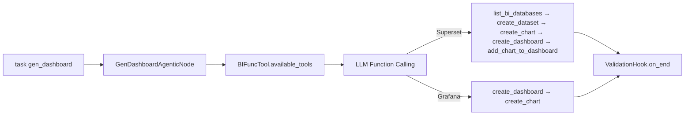
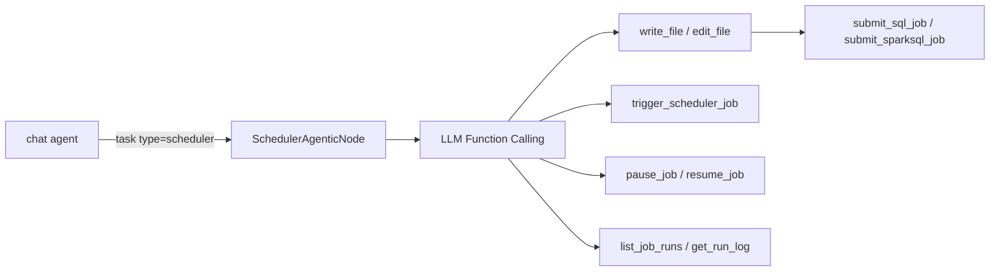

# 内置 Subagent

## 概览

**内置 Subagent**  是集成在 Datus Agent 系统中的专用 AI 助手。每个subagent专注于数据工程自动化的特定方面——分析 SQL、生成语义模型、将查询转换为可复用指标——共同构成从原始 SQL 到具备知识感知的数据产品的闭环工作流。

本文档涵盖十三个核心 subagent：

1. **[gen_sql_summary](#gen_sql_summary)** — 总结和分类 SQL 查询
2. **[gen_semantic_model](#gen_semantic_model)** — 生成 MetricFlow 语义模型
3. **[gen_metrics](#gen_metrics)** — 生成 MetricFlow 指标定义
4. **[gen_ext_knowledge](#gen_ext_knowledge)** — 生成业务概念定义
5. **[explore](#explore)** — 只读数据探索和上下文收集
6. **[gen_sql](#gen_sql)** — 具备深度专业知识的专用 SQL 生成
7. **[gen_report](#gen_report)** — 灵活的报告生成，支持可配置工具
8. **[gen_table](gen_table.zh.md)** — 数据库建表（CTAS 或自然语言描述）
9. **[gen_job](gen_job.zh.md)** — 数据管道执行（单库 ETL 和跨库迁移，含对数校验）
10. **[gen_skill](#gen_skill)** — skill 创建与优化
11. **[gen_dashboard](#gen_dashboard)** — Superset 和 Grafana 的 BI 仪表盘 CRUD
12. **[scheduler](#scheduler)** — Airflow 作业生命周期管理

## 配置

内置subagent开箱即用，最小化配置。大部分设置（工具、hooks、MCP 服务器、系统提示）都是内置的。你可以在 `agent.yml` 文件中自定义：

```yaml
agent:
  agentic_nodes:
    gen_semantic_model:
      model: claude     # 可选：默认使用已配置的模型
      max_turns: 30     # 可选：默认为 30

    gen_metrics:
      model: claude     # 可选：默认使用已配置的模型
      max_turns: 30     # 可选：默认为 30

    gen_sql_summary:
      model: deepseek   # 可选：默认使用已配置的模型
      max_turns: 30     # 可选：默认为 30

    gen_ext_knowledge:
      model: claude     # 可选：默认使用已配置的模型
      max_turns: 30     # 可选：默认为 30

    explore:
      model: haiku      # 推荐：较小模型适合工具调用任务
      max_turns: 15     # 可选：默认为 15

    gen_sql:
      model: claude     # 可选：默认使用已配置的模型
      max_turns: 30     # 可选：默认为 30

    gen_report:
      model: claude     # 可选：默认使用已配置的模型
      max_turns: 30     # 可选：默认为 30
      tools: "semantic_tools.*, context_search_tools.list_subject_tree"  # 可选：默认使用语义+上下文工具

    gen_table:
      max_turns: 20     # 可选：默认为 20

    gen_job:
      max_turns: 30     # 可选：默认为 30

    gen_skill:
      max_turns: 30     # 可选：默认为 30

    gen_dashboard:
      model: claude     # 可选：默认使用已配置的模型
      max_turns: 30     # 可选：默认为 30
      bi_platform: superset  # 可选：显式指定平台（仅配置一个 BI 平台时可自动检测）

    scheduler:
      model: claude     # 可选：默认使用已配置的模型
      max_turns: 30     # 可选：默认为 30
```

**可选配置参数**：

- `model`：使用的 AI 模型（如 `claude`、`deepseek`）。默认使用已配置的模型。
- `max_turns`：最大对话轮数（默认：30）

**内置配置**（无需设置）：
- **工具**：根据 subagent 类型自动配置
- **Hooks**：按工作流启用验证和知识库同步
- **MCP 服务器**：MetricFlow 验证（用于 gen_semantic_model 和 gen_metrics）
- **系统提示**：内置模板；未设置 `prompt_version` 时使用最新可用版本
- **工作空间**：`~/.datus/data/{datasource}/` 及 subagent 特定子目录

---

## gen_sql_summary

### 概览

SQL 摘要功能帮助你分析、分类和编目 SQL 查询，用于知识复用。它自动生成结构化的 YAML 摘要，存储在可搜索的知识库中，便于将来查找和复用相似的查询。

### 什么是 SQL 摘要？

**SQL 摘要** 是一个结构化 YAML 文档，包含：

- **查询文本**：完整的 SQL 查询
- **业务上下文**：域、类别和标签
- **语义摘要**：用于向量搜索的详细说明
- **元数据**：名称、注释、文件路径

### 快速开始

启动 SQL 摘要生成 subagent：

```bash
/gen_sql_summary Analyze this SQL: SELECT SUM(revenue) FROM sales GROUP BY region. (You can also add some description on this SQL)
```

### 生成工作流


**详细步骤**：

1. **理解 SQL**：AI 分析你的查询结构和业务逻辑
2. **获取上下文**：自动从知识库检索：
   - 现有主题树（domain/layer1/layer2 组合）
   - 类似的 SQL 摘要（最相似的前 5 个查询）用于分类参考
3. **生成唯一 ID**：使用 `generate_sql_summary_id()` 工具，基于 SQL + 注释生成
4. **创建唯一名称**：生成描述性名称（最多 20 个字符）
5. **分类查询**：按照现有模式分配域、layer1、layer2 和标签
6. **生成 YAML**：创建结构化摘要文档
7. **保存文件**：使用 `write_file()` 工具将 YAML 写入工作空间
8. **同步到知识库**：存储到 LanceDB 用于语义搜索

### 同步行为

在 interactive 模式下，YAML 文件写入成功后，generation hook 会自动把它同步到知识库。在 workflow/API 模式下，请使用对应的显式同步步骤或工具。

### 主题树分类

在 CLI 模式下通过问题中包含主题树来组织 SQL 摘要：

**带主题树示例：**
```bash
/gen_sql_summary Analyze this SQL: SELECT SUM(revenue) FROM sales, subject_tree: sales/reporting/revenue_analysis
```

**不带主题树示例：**
```bash
/gen_sql_summary Analyze this SQL: SELECT SUM(revenue) FROM sales
```

未提供时，agent 会基于知识库中的现有主题树和相似查询自动建议分类。

### YAML 结构

生成的 SQL 摘要遵循以下结构：

```yaml
id: "abc123def456..."                      # 自动生成的 MD5 哈希
name: "Revenue by Region"                  # 描述性名称（最多 20 个字符）
sql: |                                     # 完整 SQL 查询
  SELECT
    region,
    SUM(revenue) as total_revenue
  FROM sales
  GROUP BY region
comment: "Calculate total revenue grouped by region"
summary: "This query aggregates total revenue from the sales table, grouping results by geographic region. It uses SUM aggregation to calculate revenue totals for each region."
filepath: "/Users/you/.datus/data/reference_sql/revenue_by_region.yml"
domain: "Sales"                            # 业务域
layer1: "Reporting"                        # 主要类别
layer2: "Revenue Analysis"                 # 次要类别
tags: "revenue, region, aggregation"       # 逗号分隔的标签
```

#### 字段说明

| 字段 | 必需 | 描述 | 示例 |
|-------|----------|-------------|---------|
| `id` | 是 | 唯一哈希（自动生成） | `abc123def456...` |
| `name` | 是 | 简短描述性名称（最多 20 个字符） | `Revenue by Region` |
| `sql` | 是 | 完整 SQL 查询 | `SELECT ...` |
| `comment` | 是 | 简短的单行描述 | 用户消息或生成的摘要 |
| `summary` | 是 | 详细说明（用于搜索） | 全面的查询描述 |
| `filepath` | 是 | 实际文件路径 | `/path/to/file.yml` |
| `domain` | 是 | 业务域 | `Sales`、`Marketing`、`Finance` |
| `layer1` | 是 | 主要类别 | `Reporting`、`Analytics`、`ETL` |
| `layer2` | 是 | 次要类别 | `Revenue Analysis`、`Customer Insights` |
| `tags` | 可选 | 逗号分隔的关键字 | `revenue, region, aggregation` |

---

## gen_semantic_model

### 概览

语义模型生成功能帮助你通过 AI 助手从数据库表创建 MetricFlow 语义模型。助手分析你的表结构并生成全面的 YAML 配置文件，定义指标、维度和关系。

### 什么是语义模型？

语义模型是定义以下内容的 YAML 配置：

- **度量（Measures）**：指标和聚合（SUM、COUNT、AVERAGE 等）
- **维度（Dimensions）**：分类和时间属性
- **标识符（Identifiers）**：用于关系的主键和外键
- **数据源（Data Source）**：与数据库表的连接

### 快速开始

使用 `datus --database <datasource>` 启动 Datus CLI，然后使用subagent命令：

```bash
/gen_semantic_model generate a semantic model for table <table_name>
```

### 工作原理

#### 交互式生成

当你请求语义模型时，AI 助手会：

1. 检索你的表的 DDL（结构）
2. 检查是否已存在语义模型
3. 生成全面的 YAML 文件
4. 使用 MetricFlow 验证配置
5. 验证通过后同步到知识库

#### 生成工作流


### 验证和同步

发布前，agent 会调用 `validate_semantic()`。如果验证失败，会修改 YAML 并重试。在 interactive 模式下，验证通过后，`end_semantic_model_generation` 会触发自动知识库同步；在 workflow/API 模式下，请使用显式的语义模型同步步骤或工具。

### 语义模型结构

#### 基本模板

```yaml
data_source:
  name: table_name                    # 必需：小写加下划线
  description: "Table description"

  sql_table: schema.table_name        # 对于有 schema 的数据库
  # OR
  sql_query: |                        # 对于自定义查询
    SELECT * FROM table_name

  measures:
    - name: total_amount              # 必需
      agg: SUM                        # 必需：SUM|COUNT|AVERAGE|etc.
      expr: amount_column             # 列或 SQL 表达式
      create_metric: true             # 自动创建可查询指标
      description: "Total transaction amount"

  dimensions:
    - name: created_date
      type: TIME                      # 必需：TIME|CATEGORICAL
      type_params:
        is_primary: true              # 需要一个主时间维度
        time_granularity: DAY         # TIME 必需：DAY|WEEK|MONTH|etc.

    - name: status
      type: CATEGORICAL
      description: "Order status"

  identifiers:
    - name: order_id
      type: PRIMARY                   # PRIMARY|FOREIGN|UNIQUE|NATURAL
      expr: order_id

    - name: customer
      type: FOREIGN
      expr: customer_id
```

### 总结

语义模型生成功能提供：

- ✅ 从表 DDL 自动生成 YAML
- ✅ 交互式验证和错误修复
- ✅ 验证通过后自动同步
- ✅ 知识库集成
- ✅ 防止重复
- ✅ MetricFlow 兼容性

---

## gen_metrics

### 概览

指标生成功能帮助你将 SQL 查询转换为可复用的 MetricFlow 指标定义。使用 AI 助手，你可以分析 SQL 业务逻辑并自动生成标准化的 YAML 指标配置，组织内可一致查询。

### 什么是指标？

**指标**是基于语义模型构建的可复用业务计算。指标提供：

- **一致的业务逻辑**：一次定义，到处使用
- **类型安全**：已验证的结构和度量引用
- **元数据**：显示名称、格式、业务上下文
- **可组合性**：从简单指标构建复杂指标

**示例**：与其重复编写 `SELECT SUM(revenue) / COUNT(DISTINCT customer_id)`，不如定义一次 `avg_customer_revenue` 指标。

### 快速开始

使用 `datus --database <datasource>` 启动 Datus CLI，然后使用指标生成subagent：

```bash
/gen_metrics Generate a metric from this SQL: SELECT SUM(amount) FROM transactions, the corresponding question is total amount of all transactions
```

### 工作原理

#### 生成工作流


#### 重要限制

> **⚠️ 仅支持单表查询**
>
> 当前版本**仅支持从单表 SQL 查询生成指标**。不支持多表 JOIN。

**支持**：
```sql
SELECT SUM(revenue) FROM transactions WHERE status = 'completed'
SELECT COUNT(DISTINCT customer_id) / COUNT(*) FROM orders
```

**不支持**：
```sql
SELECT SUM(o.amount)
FROM orders o
JOIN customers c ON o.customer_id = c.id  -- ❌ 不支持 JOIN
```

### 验证和同步

发布前，agent 会用 `validate_semantic()` 校验 YAML，并用 `query_metrics(..., dry_run=True)` 编译 SQL。在 interactive 模式下，两项检查都通过后，`end_metric_generation` 会触发自动知识库同步；在 workflow/API 模式下，请使用显式的指标同步步骤或工具。

### 主题树分类

在 CLI 模式下通过问题中包含主题树来组织指标：

**带主题树示例：**
```bash
/gen_metrics Generate a metric from this SQL: SELECT SUM(amount) FROM transactions, subject_tree: finance/revenue/transactions
```

**不带主题树示例：**
```bash
/gen_metrics Generate a metric from this SQL: SELECT SUM(amount) FROM transactions
```

未提供时，agent 会基于知识库中的现有指标自动建议分类。

### 使用示例

#### 示例 1：简单聚合

**用户输入**：
```bash
/gen_metrics Generate a metric for total order count
```

**智能体操作**：
1. 查找 `orders.yml` 语义模型
2. 读取文件以发现 `order_count` 度量
3. 生成 MEASURE_PROXY 指标：

```yaml
---
metric:
  name: total_orders
  description: Total number of orders
  type: measure_proxy
  type_params:
    measure: order_count
  locked_metadata:
    display_name: "Total Orders"
    increase_is_good: true
```

#### 示例 2：转化率

**用户输入**：
```bash
/gen_metrics Create a metric from this SQL:
SELECT
  COUNT(DISTINCT CASE WHEN status = 'completed' THEN order_id END) /
  COUNT(DISTINCT order_id) AS completion_rate
FROM orders
```

**智能体操作**：
1. 分析 SQL 逻辑（带条件计数的比率）
2. 查找 `orders.yml` 并读取度量
3. 生成带约束的 RATIO 指标：

```yaml
---
metric:
  name: order_completion_rate
  description: Percentage of orders that reached completed status
  type: ratio
  type_params:
    numerator:
      name: order_count
      constraint: status = 'completed'
    denominator: order_count
  locked_metadata:
    display_name: "Order Completion Rate"
    value_format: ".2%"
    increase_is_good: true
```

#### 示例 3：复杂计算

**用户输入**：
```bash
/gen_metrics Generate average basket size metric:
SELECT SUM(total_amount) / COUNT(DISTINCT order_id)
FROM order_items
```

**智能体操作**：
1. 定位 `order_items.yml`
2. 识别为 RATIO（平均值）
3. 生成指标：

```yaml
---
metric:
  name: avg_basket_size
  description: Average order value (basket size)
  type: ratio
  type_params:
    numerator: total_amount
    denominator: order_count
  locked_metadata:
    display_name: "Average Basket Size"
    value_format: "$$,.2f"
    unit: "dollars"
    increase_is_good: true
```

### 指标存储方式

#### 文件组织

指标存放在独立文件中，与语义模型文件分离：

- **语义模型**：`{table_name}.yml` —— `data_source` 定义（measures、dimensions、identifiers）
- **指标**：`metrics/{table_name}_metrics.yml` —— 一个或多个指标定义，使用 YAML 文档分隔符 `---` 分隔

**语义模型文件** (`transactions.yml`)：
```yaml
data_source:
  name: transactions
  sql_table: transactions
  measures:
    - name: revenue
      agg: SUM
      expr: amount
  dimensions:
    - name: transaction_date
      type: TIME
```

**指标文件** (`metrics/transactions_metrics.yml`)：
```yaml
metric:
  name: total_revenue
  type: measure_proxy
  type_params:
    measure: revenue

---
metric:
  name: avg_transaction_value
  type: ratio
  type_params:
    numerator: revenue
    denominator: transaction_count
```

**为什么使用独立文件？**
- 清晰分离 schema 定义与业务指标
- 指标可以独立于底层语义模型维护
- MetricFlow 会把 semantic_models 目录下所有 YAML 文档一起验证

更多细节见 [gen_metrics](gen_metrics.zh.md)。

#### 知识库存储

验证和 dry-run SQL 通过后，指标会同步到知识库，包含：

1. **元数据**：名称、描述、类型、域/层级分类
2. **LLM 文本**：用于语义搜索的自然语言表示
3. **引用**：关联的语义模型名称
4. **时间戳**：创建日期

### 总结

指标生成功能提供：

- ✅ **SQL 到指标转换**：分析 SQL 查询并生成 MetricFlow 指标
- ✅ **智能类型检测**：自动选择正确的指标类型
- ✅ **防止重复**：生成前检查现有指标
- ✅ **主题树支持**：按 domain/layer1/layer2 组织，支持预定义或学习模式
- ✅ **验证**：MetricFlow 验证确保正确性
- ✅ **发布门禁**：语义验证和 dry-run SQL 通过后才同步
- ✅ **知识库集成**：语义搜索以发现指标
- ✅ **文件管理**：在 `metrics/` 目录下维护独立的指标文件

---

## gen_ext_knowledge

### 概览

外部知识生成功能帮助你创建和管理业务概念和特定领域定义。使用 AI 助手，你可以将业务知识以结构化格式文档化，存储在知识库中可被搜索，从而为 SQL 生成和数据分析任务提供更好的上下文检索。

### 什么是外部知识？

**外部知识**捕获未直接存储在数据库 schema 中的业务特定信息：

- **业务规则**：计算逻辑和业务约束
- **领域概念**：行业或公司特定知识
- **数据解释**：如何理解特定数据字段或值

这些知识帮助 AI agent 在生成 SQL 查询或分析数据时理解你的业务上下文。

### 快速开始

启动外部知识生成 subagent：

```bash
/gen_ext_knowledge Extract knowledge from this sql
-- Question: What is the highest eligible free rate for K-12 students in the schools in Alameda County?
-- SQL:
SELECT
  `Free Meal Count (K-12)` / `Enrollment (K-12)`
FROM
  frpm
WHERE
  `County Name` = 'Alameda'
ORDER BY
  (
    CAST(`Free Meal Count (K-12)` AS REAL) / `Enrollment (K-12)`
  ) DESC
LIMIT 1
```

### 生成工作流

工作流遵循**知识缺口发现**方法：agent 首先尝试独立解决问题，然后与参考 SQL 比较以识别隐含的业务知识。


**详细步骤**：

1. **理解问题**：从 SQL 注释中读取问题并理解目标
2. **尝试解决**：agent 使用可用工具尝试解决问题
3. **与参考 SQL 比较**：找出尝试结果与参考 SQL 之间的差距
4. **从差距中提取知识**：发现差距中隐藏的业务概念
5. **检查重复**：使用 `search_knowledge` 验证提取的知识是否已存在
6. **生成 YAML**：通过 `generate_ext_knowledge_id()` 创建带有唯一 ID 的结构化知识条目
7. **保存文件**：使用 `write_file(path, content, file_type="ext_knowledge")` 写入 YAML
8. **同步到知识库**：存储到向量数据库用于语义搜索

> **重要**：如果未发现知识缺口（agent 的尝试与参考 SQL 匹配），则不生成知识文件。

### 同步行为

在 interactive 模式下，YAML 文件写入成功后，generation hook 会自动把它同步到知识库。在 workflow/API 模式下，请使用显式同步步骤或工具。

### 主题路径分类

主题路径允许对外部知识进行层次化组织。在 CLI 模式下，在问题中包含它：

**带主题路径示例：**
```bash
/gen_ext_knowledge Extract knowledge from this sql
Question: What is the highest eligible free rate for K-12 students in the schools in Alameda County?
subject_tree: education/schools/data_integration
SQL: ***
```

**不带主题路径示例：**
```bash
/gen_ext_knowledge Extract knowledge from this sql
Question: What is the highest eligible free rate for K-12 students in the schools in Alameda County?
SQL: ***
```

未提供时，agent 会基于知识库中现有的主题树自动建议分类。

### YAML 结构

生成的外部知识遵循以下结构：

```yaml
id: education/schools/data_integration/CDS code school identifier California Department of Education join tables
name: CDS Code as School Identifier
search_text: CDS code school identifier California Department of Education join tables
explanation: |
  The CDS (California Department of Education) code serves as the primary identifier for linking educational datasets in California. Use `cds` field in SAT scores table to join
subject_path: education/schools/data_integration
```

#### 字段说明

| 字段 | 必需 | 描述                                          | 示例 |
|-------|----------|---------------------------------------------|---------|
| `id` | 是 | 唯一ID（通过 `generate_ext_knowledge_id()` 自动生成） | `education/schools/data_integration/CDS code school identifier California Department of Education join tables` |
| `name` | 是 | 简短标识名称（最多 30 个字符）                           | `Free Meal Rate`、`GMV` |
| `search_text` | 是 | 检索用的搜索关键词（向量/倒排索引）                          | `eligible free rate K-12` |
| `explanation` | 是 | 简洁说明（2-4 句）：是什么 + 何时/如何应用                   | 业务规则、计算逻辑 |
| `subject_path` | 是 | 层次化分类（斜杠分隔）                                 | `Education/School Metrics/FRPM` |

---

## explore

### 概览

explore subagent 是一个轻量级只读助手，专为快速上下文收集设计。它帮助收集 schema 信息、数据采样和知识库上下文，为下游 SQL 生成提供支持——无论是聊天助手还是 gen_sql subagent。

### 关键特性

- **严格只读**：不会修改数据、文件或数据库记录。仅允许 SELECT 查询，且始终带 LIMIT。
- **快速探索**：限制 15 轮对话，快速完成上下文收集。
- **三方向探索**：
  - **Schema+Sample**：发现表、列、类型、约束和采样数据
  - **Knowledge**：搜索指标、参考 SQL、业务规则和领域知识
  - **File**：浏览工作空间 SQL 文件和文档

### 配置

```yaml
agent:
  agentic_nodes:
    explore:
      model: haiku           # 推荐：使用较小模型（haiku、gpt-4o-mini）
      max_turns: 15           # 可选：默认为 15
```

> **提示**：explore subagent 以工具调用为主，而非复杂推理。推荐使用较小、更快的模型（如 `haiku`、`gpt-4o-mini`），可降低成本并提升速度，同时不影响质量。

### 可用工具

| 工具类别 | 工具 | 用途 |
|---------|------|------|
| 数据库 | `list_databases`、`list_schemas`、`list_tables`、`search_table`、`describe_table`、`get_table_ddl`、`read_query` | Schema 发现和数据采样（只读） |
| 上下文搜索 | `search_metrics`、`search_reference_sql`、`search_knowledge`、`search_semantic_objects`、`list_subject_tree`、`get_metrics`、`get_reference_sql`、`get_knowledge` | 知识库检索 |
| 文件系统 | `read_file`、`glob`、`grep` | 只读文件浏览 |
| 日期解析 | `get_current_date`、`parse_temporal_expressions` | 日期上下文 |

### 输出格式

explore subagent 返回简洁的结构化摘要，为其他 agent 消费而优化：

- **Tables**：相关表及关键列、类型和备注
- **Joins**：表之间的联接路径（每个关系一行）
- **Data patterns**：非显而易见的数据模式（分隔符、编码、NULL 占比）
- **Context**：找到的相关指标、参考 SQL 和业务规则
- **Recommendation**：使用哪些表、如何联接及关键注意事项

### 使用方式

explore subagent 通常由聊天助手通过 `task(type="explore")` 自动调用，也可手动启动：

```bash
/explore Discover tables related to customer revenue and find relevant metrics
```

---

## gen_sql

### 概览

gen_sql subagent 是一个专用 SQL 专家，生成经过优化和验证的 SQL 查询。它处理需要多步推理、复杂联接或领域特定逻辑的复杂 SQL 生成任务。

### 关键特性

- **深度 SQL 专业知识**：专注于编写复杂的生产级 SQL
- **自动验证**：返回结果前验证 SQL 可执行性
- **基于文件的输出**：对于复杂查询（50+ 行），将 SQL 输出到文件并提供预览
- **修改支持**：修改现有查询时返回 unified diff 格式

### 配置

```yaml
agent:
  agentic_nodes:
    gen_sql:
      model: claude           # 可选：默认使用已配置的模型
      max_turns: 30           # 可选：默认为 30
```

### 工作原理


### 输出格式

gen_sql subagent 以两种格式之一返回结果：

**内联 SQL**（适用于较短查询）：
```json
{
  "sql": "SELECT region, SUM(revenue) FROM sales GROUP BY region",
  "response": "查询解释...",
  "tokens_used": 1234
}
```

**基于文件的 SQL**（适用于 50+ 行的复杂查询）：
```json
{
  "sql_file_path": "/path/to/generated_query.sql",
  "sql_preview": "查询的前几行...",
  "response": "查询解释...",
  "tokens_used": 5678
}
```

### 使用方式

gen_sql subagent 通常由聊天助手通过 `task(type="gen_sql")` 自动调用来处理复杂查询，也可手动启动：

```bash
/gen_sql Generate a query to calculate customer lifetime value with cohort analysis
```

---

## gen_report

### 概览

gen_report subagent 是一个灵活的报告生成助手，结合语义工具、数据库工具和上下文搜索功能来生成结构化报告。它可以直接使用，也可以被特定领域的报告节点扩展（如归因分析）。

### 关键特性

- **可配置工具**：通过配置支持 `semantic_tools.*`、`db_tools.*` 和 `context_search_tools.*`
- **灵活输出**：生成包含 SQL 查询和分析的结构化报告内容
- **可扩展**：可以被子类化用于特定报告类型
- **配置驱动**：工具设置和系统提示由 `agent.yml` 配置驱动

### 配置

```yaml
agent:
  agentic_nodes:
    gen_report:
      model: claude           # 可选：默认使用已配置的模型
      max_turns: 30           # 可选：默认为 30
      tools: "semantic_tools.*, db_tools.*, context_search_tools.list_subject_tree"  # 可选：自定义可用工具
```

**工具模式：**

| 模式 | 描述 |
|------|------|
| `semantic_tools.*` | 所有语义工具（搜索指标、语义对象等） |
| `db_tools.*` | 所有数据库工具（列出表、描述表、读取查询等） |
| `context_search_tools.*` | 所有上下文搜索工具（搜索知识、参考 SQL 等） |
| `semantic_tools.search_metrics` | 指定的语义工具方法 |
| `context_search_tools.list_subject_tree` | 指定的上下文搜索方法 |

默认工具（未配置时）：`semantic_tools.*, context_search_tools.list_subject_tree`

### 工作原理


### 输出格式

gen_report subagent 以结构化报告返回结果：

```json
{
  "report": "包含分析的结构化报告内容...",
  "response": "摘要说明...",
  "tokens_used": 2345
}
```

### 使用方式

gen_report subagent 可以手动启动，也可以由聊天助手通过 `task(type="gen_report")` 调用：

```bash
/gen_report 分析上季度的收入趋势并提供洞察
```

### 自定义报告 Subagent

你可以在 `agent.yml` 中配置使用 gen_report 节点类的自定义 subagent：

```yaml
agent:
  agentic_nodes:
    attribution_report:
      node_class: gen_report
      tools: "semantic_tools.*, db_tools.*, context_search_tools.*"
      max_turns: 30
```

然后通过 `/attribution_report 分析活动 X 的转化归因` 使用。

---

## gen_skill

### 概览

`gen_skill` subagent 用于引导用户创建或优化 Datus skill。它可以检查现有 skill、脚手架新的 skill 目录、编辑 `SKILL.md`、执行校验，并检索历史会话中的使用模式。

### 关键特性

- **交互式 skill 编写**：通过 `ask_user` 进行访谈式创建
- **受控文件系统权限**：对工作区只读，对配置的 skills 目录可写
- **skill 感知编辑**：修改前先加载已有 skill
- **内置校验**：结束前可调用 `validate_skill` 检查结果

### 配置

```yaml
agent:
  agentic_nodes:
    gen_skill:
      model: claude
      max_turns: 30
```

### 输出格式

```json
{
  "response": "已创建一个用于财务仪表盘校验的新 skill。",
  "skill_name": "finance-dashboard-validation",
  "skill_path": "/path/to/skills/finance-dashboard-validation",
  "tokens_used": 1980
}
```

### 使用方式

直接启动：

```bash
/gen_skill 创建一个在发布前校验每日收入仪表盘的 skill
```

也可以由聊天 agent 通过 `task(type="gen_skill")` 自动委派。

---

## gen_dashboard

### 概览

gen_dashboard subagent 在 Superset 和 Grafana 上创建、更新和管理 BI 仪表盘。它由聊天 agent 通过 `task(type="gen_dashboard")` 调用，使用 `BIFuncTool` 中的 BI 工具，基于已存在的 serving 表或 SQL dataset 创建 dashboard 资产。

### 关键特性

- **多平台支持**：支持 Apache Superset 和 Grafana；平台可通过 `bi_platform` 显式指定，或从 `agent.services.bi_platforms` 自动检测
- **动态工具暴露**：工具根据 adapter Mixin 能力动态暴露——只有平台实际支持的操作才作为 LLM 工具出现
- **只处理已就位的 serving 数据**：数据准备由 `gen_job` / `scheduler` 单独完成；gen_dashboard 负责创建 BI dataset / chart / dashboard 资产
- **Skill 引导**：平台 skill（`superset-dashboard`、`grafana-dashboard`）提供分步工作流；`bi-validation` 在创建结束后自动运行

### 配置

```yaml
agent:
  services:
    datasources:
      serving_pg:
        type: postgresql
        host: 127.0.0.1
        port: 5433
        database: superset_examples
        schema: bi_public
        username: "${SERVING_WRITE_USER}"
        password: "${SERVING_WRITE_PASSWORD}"

    bi_platforms:
      superset:
        type: superset
        api_base_url: "http://localhost:8088"
        username: "${SUPERSET_USER}"
        password: "${SUPERSET_PASSWORD}"
        dataset_db:
          datasource_ref: serving_pg
          bi_database_name: analytics_pg

  agentic_nodes:
    gen_dashboard:
      model: claude           # 可选：默认使用已配置的模型
      max_turns: 30           # 可选：默认为 30
      bi_platform: superset   # 可选：只配置一个 BI 平台时可自动检测
```

**前置条件**：
- `agent.yml` 中包含 `agent.services.bi_platforms` 配置段及平台凭据
- 已安装 `datus-bi-superset` 或 `datus-bi-grafana` 包

### 工作原理



### 可用工具

工具根据平台 adapter 实现的 Mixin 动态暴露：

| 工具 | 所需能力 | 说明 |
|------|---------|------|
| `list_dashboards` | 所有 adapter | 列出/搜索仪表盘 |
| `get_dashboard` | 所有 adapter | 获取仪表盘详情 |
| `list_charts` | 所有 adapter | 列出仪表盘下的图表 |
| `get_chart` | 所有 adapter | 获取单个图表或面板详情 |
| `get_chart_data` | 支持的 adapter | 获取图表查询结果，用于数值校验 |
| `list_datasets` | 所有 adapter | 列出数据集/数据源 |
| `create_dashboard` | `DashboardWriteMixin` | 创建仪表盘 |
| `update_dashboard` | `DashboardWriteMixin` | 更新仪表盘标题/描述 |
| `delete_dashboard` | `DashboardWriteMixin` | 删除仪表盘 |
| `create_chart` | `ChartWriteMixin` | 创建图表/面板 |
| `update_chart` | `ChartWriteMixin` | 更新图表配置 |
| `add_chart_to_dashboard` | `ChartWriteMixin` | 将图表添加到仪表盘 |
| `delete_chart` | `ChartWriteMixin` | 删除图表 |
| `create_dataset` | `DatasetWriteMixin` | 注册数据集 |
| `list_bi_databases` | `DatasetWriteMixin` | 列出 BI 平台数据库连接 |
| `delete_dataset` | `DatasetWriteMixin` | 删除数据集 |
| `get_bi_serving_target` | 已配置 `dataset_db` | 给编排层返回 serving DB 契约 |

### 输出格式

```json
{
  "response": "已创建包含 3 个营收趋势图表的销售仪表盘。",
  "dashboard_result": {
    "dashboard_id": 42,
    "url": "http://localhost:8088/superset/dashboard/42/"
  },
  "tokens_used": 3210
}
```

### 使用方式

gen_dashboard subagent 通常由聊天 agent 通过 `task(type="gen_dashboard")` 自动调用，也可手动启动：

```bash
/gen_dashboard 创建一个包含按地区划分的营收趋势的销售仪表盘
```

也可以使用 `gen_dashboard` 节点类创建自定义 subagent：

```yaml
agent:
  agentic_nodes:
    sales_dashboard:
      node_class: gen_dashboard
      bi_platform: superset
      max_turns: 30
```

---

## scheduler

### 概览

scheduler subagent 在 Apache Airflow 上提交、监控、更新和排查定时作业。它由聊天 agent 通过 `task(type="scheduler")` 调用，通过 LLM function calling 提供完整的 Airflow 作业生命周期管理。

### 关键特性

- **完整作业生命周期**：提交、触发、暂停、恢复、更新和删除 Airflow DAG 作业
- **SQL 和 SparkSQL 支持**：支持提交 SQL 和 SparkSQL 两种作业类型
- **SQL 文件管理**：提交前可用文件系统工具创建或更新作业 SQL 文件
- **监控能力**：列出作业运行记录、获取运行日志、排查故障
- **连接发现**：列出可用的 Airflow 连接，用于作业配置

### 配置

```yaml
agent:
  services:
    schedulers:
      airflow_prod:
        type: airflow
        api_base_url: "${AIRFLOW_URL}"
        username: "${AIRFLOW_USER}"
        password: "${AIRFLOW_PASSWORD}"
        dags_folder: "${AIRFLOW_DAGS_DIR}"

  agentic_nodes:
    scheduler:
      model: claude                  # 可选：默认使用已配置的模型
      max_turns: 30                  # 可选：默认为 30
      scheduler_service: airflow_prod
```

**前置条件**：
- `agent.yml` 中包含 `agent.services.schedulers` 配置段及 Airflow 凭据
- 已安装 `datus-scheduler-airflow` 包（会自动拉取 `datus-scheduler-core`）

### 工作原理



### 可用工具

| 工具 | 说明 |
|------|------|
| `submit_sql_job` | 从 `.sql` 文件提交带 cron 表达式的定时 SQL 作业 |
| `submit_sparksql_job` | 从 `.sql` 文件提交定时 SparkSQL 作业 |
| `read_file` / `write_file` / `edit_file` | 读取、创建或更新定时作业使用的 SQL 文件 |
| `trigger_scheduler_job` | 手动触发一次现有作业运行 |
| `pause_job` | 暂停定时作业 |
| `resume_job` | 恢复已暂停的作业 |
| `delete_job` | 删除定时作业 |
| `update_job` | 更新作业调度或配置 |
| `get_scheduler_job` | 获取作业详情和当前状态 |
| `list_scheduler_jobs` | 列出所有定时作业 |
| `list_scheduler_connections` | 列出可用的 Airflow 连接 |
| `list_job_runs` | 列出某作业的近期运行记录 |
| `get_run_log` | 获取特定作业运行的日志 |

### 输出格式

```json
{
  "response": "已提交每日 SQL 作业 'daily_revenue'，每天早上 8:00 运行。",
  "scheduler_result": {
    "job_id": "daily_revenue_dag",
    "status": "active",
    "schedule": "0 8 * * *"
  },
  "tokens_used": 1580
}
```

### 使用方式

scheduler subagent 通常由聊天 agent 通过 `task(type="scheduler")` 自动调用，也可手动启动：

```bash
/scheduler 提交 /opt/sql/daily_revenue.sql 作为每天早上 8 点运行的定时作业，使用 postgres_prod 连接
```

也可以使用 `scheduler` 节点类创建自定义 subagent：

```yaml
agent:
  agentic_nodes:
    etl_scheduler:
      node_class: scheduler
      max_turns: 30
```

---

## 总结

| subagent | 用途 | 输出 | 存储位置 | 关键特性 |
|----------|------|------|----------|----------|
| `gen_sql_summary` | 总结和分类 SQL 查询 | YAML（SQL 摘要） | `/data/reference_sql` | 主题树分类、自动上下文检索 |
| `gen_semantic_model` | 从表生成语义模型 | YAML（语义模型） | `/data/semantic_models` | DDL 到 MetricFlow 模型、内置验证 |
| `gen_metrics` | 从 SQL 生成指标 | YAML（指标） | `/data/semantic_models` | SQL 到 MetricFlow 指标、主题树支持 |
| `gen_ext_knowledge` | 生成业务概念 | YAML（外部知识） | `/data/ext_knowledge` | 从问题与 SQL 中提取业务知识 |
| `explore` | 只读数据探索 | 结构化上下文 | N/A | 严格只读、低轮数、三方向探索 |
| `gen_sql` | 生成优化 SQL | SQL 查询 / SQL 文件 | N/A | 深度 SQL 专长、自动验证、支持文件输出 |
| `gen_report` | 灵活报告生成 | 结构化报告 | N/A | 工具可配置、可扩展、自定义报告 subagent |
| `gen_table` | 交互式建表 | DDL + 执行结果 | 数据库 | DDL 确认、CTAS 或自然语言建表 |
| `gen_job` | 数据管道作业（单库 ETL + 跨库传输） | 作业 / 传输结果 | 源库 + 目标库 | DDL/DML 执行、通过 MigrationTargetMixin 做跨方言类型映射、`transfer_query_result`、源目标不同库时做轻量对账校验 |
| `gen_skill` | 创建或优化 skill | skill 路径 | skills 目录 | 交互式编写、校验、加载现有 skill |
| `gen_dashboard` | BI 仪表盘 CRUD（Superset、Grafana） | 仪表盘结果 | BI 平台 | 动态工具暴露、基于已就位 serving 数据、多平台支持 |
| `scheduler` | Airflow 作业生命周期管理 | 调度结果 | Airflow | 提交、监控、更新和排障 |

**所有 subagent 的内置特性：**
- 最小化配置（仅 `model` 和 `max_turns` 可选）
- 自动工具设置、hooks 和 MCP 服务器集成
- 内置系统提示，默认选择最新可用版本
- 按工作流启用验证和知识库同步
- 知识库集成用于语义搜索
- 自动工作空间管理

这些subagent共同自动化了 **数据工程知识管道** ——从 **数据探索 → 查询生成 → 模型定义 → 指标生成 → 业务知识捕获 → 可搜索的知识库**。
