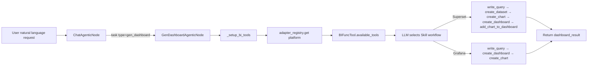

# BI Dashboard Generation Guide

## Overview

The BI dashboard generation subagent creates, updates, and manages dashboards on Apache Superset and Grafana through an AI-powered assistant. It is invoked by the chat agent via `task(type="gen_dashboard")` and drives the full dashboard creation workflow using LLM function calling over the `BIFuncTool` layer.

## What is the BI Dashboard Subagent?

The gen_dashboard subagent is a specialized node (`GenDashboardAgenticNode`) that:

- Connects to a configured BI platform (Superset or Grafana) via the `datus-bi-adapters` registry
- Exposes platform-appropriate tools dynamically based on adapter Mixin capabilities
- Materializes source database query results into the BI platform's own database via `write_query`
- Follows platform-specific skill workflows to build complete, publishable dashboards

## Quick Start

Ensure you have configured `agent.services.bi_platforms` in `agent.yml` and installed the appropriate adapter package:

```bash
pip install datus-bi-superset   # For Superset
# or
pip install datus-bi-grafana    # For Grafana
```

Then invoke the subagent from the chat interface:

```bash
/gen_dashboard Create a sales dashboard with revenue trends by region
```

## How It Works

### Generation Workflow



### Superset Workflow (5 steps)

1. `write_query(sql, table_name)` — Execute SQL on source DB, materialize results to Superset DB
2. `create_dataset(name, database_id)` — Register the materialized table as a Superset dataset
3. `create_chart(type, title, dataset_id, metrics, ...)` — Create visualization chart
4. `create_dashboard(title)` — Create the dashboard container
5. `add_chart_to_dashboard(chart_id, dashboard_id)` — Assemble chart into dashboard

### Grafana Workflow (3 steps)

1. `write_query(sql, table_name)` — Execute SQL on source DB, materialize results to Grafana DB
2. `create_dashboard(title)` — Create the dashboard
3. `create_chart(type, title, sql=..., dashboard_id=...)` — Create panel with embedded SQL

## Available Tools

Tools are exposed dynamically based on which Mixins the platform adapter implements:

| Tool | Required Capability | Description |
|------|--------------------|----|
| `list_dashboards` | All adapters | List and search existing dashboards |
| `get_dashboard` | All adapters | Get dashboard details and metadata |
| `list_charts` | All adapters | List charts within a dashboard |
| `get_chart` | All adapters | Get details for a specific chart or panel |
| `get_chart_data` | Supported adapters | Get chart query result rows for numeric validation |
| `list_datasets` | All adapters | List datasets or datasources |
| `create_dashboard` | `DashboardWriteMixin` | Create a new dashboard |
| `update_dashboard` | `DashboardWriteMixin` | Update dashboard title or description |
| `delete_dashboard` | `DashboardWriteMixin` | Delete a dashboard |
| `create_chart` | `ChartWriteMixin` | Create a chart or Grafana panel |
| `update_chart` | `ChartWriteMixin` | Update chart configuration |
| `add_chart_to_dashboard` | `ChartWriteMixin` | Attach a chart to a dashboard |
| `delete_chart` | `ChartWriteMixin` | Delete a chart |
| `create_dataset` | `DatasetWriteMixin` | Register a dataset in Superset |
| `list_bi_databases` | `DatasetWriteMixin` | List BI platform database connections |
| `delete_dataset` | `DatasetWriteMixin` | Delete a dataset |
| `write_query` | `dataset_db_uri` configured | Materialize query results to BI database |

## Configuration

### agent.yml

```yaml
agent:
  services:
    bi_platforms:
      superset:
        type: superset
        api_base_url: "http://localhost:8088"
        username: "${SUPERSET_USER}"
        password: "${SUPERSET_PASSWORD}"
        dataset_db:
          uri: "${SUPERSET_DB_URI}"
          schema: "public"
      grafana:
        type: grafana
        api_base_url: "http://localhost:3000"
        api_key: "${GRAFANA_API_KEY}"
        dataset_db:
          uri: "${GRAFANA_DB_URI}"
          datasource_name: "PostgreSQL"

  agentic_nodes:
    gen_dashboard:
      model: claude           # Optional: defaults to configured model
      max_turns: 30           # Optional: defaults to 30
      bi_platform: superset   # Optional: auto-detected when only one BI platform is configured
```

### Configuration Parameters

| Parameter | Required | Description | Default |
|-----------|----------|-------------|---------|
| `model` | No | LLM model to use | Uses default configured model |
| `max_turns` | No | Maximum conversation turns | 30 |
| `bi_platform` | No | Explicit platform key from `services.bi_platforms` (`superset`, `grafana`) | Auto-detected when only one BI platform is configured |
| `services.bi_platforms.<platform>.type` | No | BI platform type. If set, it must match the config key | Uses the config key |
| `services.bi_platforms.<platform>.api_base_url` | Yes | BI platform API endpoint | — |
| `services.bi_platforms.<platform>.username` | Superset | Login username | — |
| `services.bi_platforms.<platform>.password` | Superset | Login password | — |
| `services.bi_platforms.<platform>.api_key` | Grafana | Grafana API key | — |
| `services.bi_platforms.<platform>.dataset_db.uri` | Yes | SQLAlchemy URI for materialization target DB | — |
| `services.bi_platforms.<platform>.dataset_db.schema` | No | Schema for materialized tables | — |
| `services.bi_platforms.<platform>.dataset_db.datasource_name` | Grafana | Grafana datasource name | — |

All sensitive values support `${ENV_VAR}` substitution.

`services.bi_platforms` is the only runtime source for BI credentials. Top-level `dashboard:` is no longer read.

## Platform Differences

| Dimension | Superset | Grafana |
|-----------|----------|---------|
| Dataset concept | Yes (physical table / virtual view) | No (SQL embedded in panel) |
| Chart prerequisite | `dataset_id` required | `dashboard_id` required |
| SQL location | Dataset layer | Panel (chart) layer |
| Database connection | `database_id` + dataset | `datasource_name` auto-resolved |
| `update_chart` support | Yes | No — delete and recreate |
| Authentication | Username + password | API key |
| Workflow steps | 5 | 3 |
| `DatasetWriteMixin` | Implemented | Not implemented |

## Output Format

```json
{
  "response": "Created sales dashboard with 3 revenue trend charts.",
  "dashboard_result": {
    "dashboard_id": 42,
    "url": "http://localhost:8088/superset/dashboard/42/"
  },
  "tokens_used": 3210
}
```

## Usage Examples

### Create a new dashboard

```bash
/gen_dashboard Create a sales dashboard with revenue trends by region and a total GMV big number
```

### Update an existing dashboard

```bash
/gen_dashboard Add a monthly active users chart to dashboard 42
```

### List existing dashboards

```bash
/gen_dashboard List all dashboards related to revenue
```

### Custom subagent using gen_dashboard node class

You can define a custom subagent that uses the `gen_dashboard` node class in `agent.yml`:

```yaml
agent:
  agentic_nodes:
    sales_dashboard:
      node_class: gen_dashboard
      bi_platform: superset
      max_turns: 30
```

Then invoke it via `/sales_dashboard Create a quarterly revenue report dashboard`.
