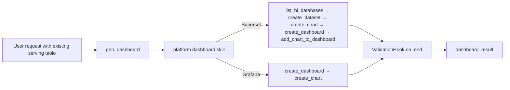

# BI Dashboard Generation Guide

## Overview

The BI dashboard generation subagent creates, updates, and manages dashboards on Apache Superset and Grafana through an AI-powered assistant. It is invoked by the chat agent via `task(type="gen_dashboard")` and builds BI assets on top of tables or SQL datasets that already exist in a BI-registered database.

`gen_dashboard` does not move data with BI tools and does not dispatch data-preparation subagents. Treat dashboard creation as the second step:

1. Use `gen_job` or `scheduler` separately to prepare / refresh the serving table.
2. Invoke `gen_dashboard` with the existing table or SQL dataset.
3. `gen_dashboard` loads the platform skill and builds dataset / chart / dashboard against the BI database identified by `bi_database_name`.

## What is the BI Dashboard Subagent?

The gen_dashboard subagent is a specialized node (`GenDashboardAgenticNode`) that:

- Connects to a configured BI platform (Superset or Grafana) via the `datus-bi-adapters` registry
- Exposes platform-appropriate tools dynamically based on adapter Mixin capabilities
- Registers the already-materialised table as a dataset / datasource and builds charts + dashboard on top
- Automatic `bi-validation` runs after the agent finishes

## Quick Start

Ensure you have configured `agent.services.bi_platforms` in `agent.yml` and installed the appropriate adapter package:

```bash
pip install datus-bi-superset   # For Superset
# or
pip install datus-bi-grafana    # For Grafana
```

Then invoke `gen_dashboard` directly or let the chat agent delegate to it:

```bash
Create a Superset dashboard over bi_public.rpt_daily_major_ac_count.
```

## How It Works

### Generation Workflow



### Superset Workflow

1. `list_bi_databases()` — pick the BI database whose name matches `dataset_db.bi_database_name`
2. `create_dataset(name, database_id)` — register the existing table as a Superset dataset
3. `create_chart(type, title, dataset_id, metrics, ...)` — create the visualization
4. `create_dashboard(title)` — create the dashboard container
5. `add_chart_to_dashboard(chart_id, dashboard_id)` — assemble chart into dashboard
6. Finish the run; `bi-validation` runs automatically through `ValidationHook.on_end`

### Grafana Workflow

1. `create_dashboard(title)` — create the dashboard
2. `create_chart(type, title, sql=..., dashboard_id=...)` — create panel with embedded SQL referencing the existing table; the datasource is auto-resolved from `dataset_db.bi_database_name`
3. Finish the run; `bi-validation` runs automatically through `ValidationHook.on_end`

## Available Tools

Tools are exposed dynamically based on which Mixins the platform adapter implements:

| Tool | Required Capability | Description |
|------|--------------------|----|
| `list_dashboards` | All adapters | List and search existing dashboards |
| `get_dashboard` | All adapters | Get dashboard details and metadata |
| `list_charts` | All adapters | List charts within a dashboard |
| `get_chart` | All adapters | Get details for a specific chart or panel |
| `get_chart_data` | Supported adapters | Get chart query result rows for numeric validation |
| `list_datasets` | All adapters | List datasets or datasources |
| `create_dashboard` | `DashboardWriteMixin` | Create a new dashboard |
| `update_dashboard` | `DashboardWriteMixin` | Update dashboard title or description |
| `delete_dashboard` | `DashboardWriteMixin` | Delete a dashboard |
| `create_chart` | `ChartWriteMixin` | Create a chart or Grafana panel |
| `update_chart` | `ChartWriteMixin` | Update chart configuration |
| `add_chart_to_dashboard` | `ChartWriteMixin` | Attach a chart to a dashboard |
| `delete_chart` | `ChartWriteMixin` | Delete a chart |
| `create_dataset` | `DatasetWriteMixin` | Register a dataset in Superset |
| `list_bi_databases` | `DatasetWriteMixin` | List BI platform database connections |
| `delete_dataset` | `DatasetWriteMixin` | Delete a dataset |
| `get_bi_serving_target` | `dataset_db` configured | Return the serving DB contract for orchestrator hand-off |

`gen_dashboard` does not expose a direct materialization tool. Data movement
belongs to a separate `gen_job` / `scheduler` step before dashboard creation.

## Configuration

### agent.yml

```yaml
agent:
  services:
    datasources:
      serving_pg:
        type: postgresql
        host: 127.0.0.1
        port: 5433
        database: superset_examples
        schema: bi_public
        username: "${SERVING_WRITE_USER}"
        password: "${SERVING_WRITE_PASSWORD}"

    bi_platforms:
      superset:
        type: superset
        api_base_url: "http://localhost:8088"
        username: "${SUPERSET_USER}"
        password: "${SUPERSET_PASSWORD}"
        dataset_db:
          datasource_ref: serving_pg
          bi_database_name: analytics_pg
      grafana:
        type: grafana
        api_base_url: "http://localhost:3000"
        api_key: "${GRAFANA_API_KEY}"
        dataset_db:
          datasource_ref: serving_pg          # can share the same serving DB
          bi_database_name: PostgreSQL

  agentic_nodes:
    gen_dashboard:
      model: claude           # Optional: defaults to configured model
      max_turns: 30           # Optional: defaults to 30
      bi_platform: superset   # Optional: auto-detected when only one BI platform is configured
```

### Configuration Parameters

| Parameter | Required | Description | Default |
|-----------|----------|-------------|---------|
| `model` | No | LLM model to use | Uses default configured model |
| `max_turns` | No | Maximum conversation turns | 30 |
| `bi_platform` | No | Explicit platform key from `services.bi_platforms` (`superset`, `grafana`) | Auto-detected when only one BI platform is configured |
| `services.bi_platforms.<platform>.type` | No | BI platform type. If set, it must match the config key | Uses the config key |
| `services.bi_platforms.<platform>.api_base_url` | Yes | BI platform API endpoint | — |
| `services.bi_platforms.<platform>.username` | Superset | Login username | — |
| `services.bi_platforms.<platform>.password` | Superset | Login password | — |
| `services.bi_platforms.<platform>.api_key` | Grafana | Grafana API key | — |
| `services.bi_platforms.<platform>.dataset_db.datasource_ref` | Yes | Name of a `services.datasources` entry. Datus uses that datasource's connector for both schema introspection and writes. | — |
| `services.bi_platforms.<platform>.dataset_db.bi_database_name` | Recommended | Alias under which the BI platform itself has registered the same DB | — |

All sensitive values support `${ENV_VAR}` substitution.

`services.bi_platforms` is the only runtime source for BI credentials. Top-level `dashboard:` is no longer read.

## Platform Differences

| Dimension | Superset | Grafana |
|-----------|----------|---------|
| Dataset concept | Yes (physical table / virtual view) | No (SQL embedded in panel) |
| Chart prerequisite | `dataset_id` required | `dashboard_id` required |
| SQL location | Dataset layer | Panel (chart) layer |
| Database connection | `database_id` from `list_bi_databases()` | Datasource auto-resolved via `bi_database_name` |
| `update_chart` support | Yes | No — delete and recreate |
| Authentication | Username + password | API key |
| Workflow steps | 6 | 3 |
| `DatasetWriteMixin` | Implemented | Not implemented |

## Output Format

```json
{
  "response": "Created sales dashboard with 3 revenue trend charts.",
  "dashboard_result": {
    "dashboard_id": 42,
    "url": "http://localhost:8088/superset/dashboard/42/"
  },
  "tokens_used": 3210
}
```

## Usage Examples

### Two-step flow

```bash
Use gen_job to write daily revenue for the last 90 days into serving_pg.bi_public.rpt_revenue_daily.
```

After the table is ready:

```bash
/gen_dashboard Create a Superset dashboard over bi_public.rpt_revenue_daily.
```

### Direct invocation (table already in serving DB)

```bash
/gen_dashboard Create a sales dashboard over bi_public.rpt_sales_daily in Superset
```

### Update an existing dashboard

```bash
/gen_dashboard Add a monthly active users chart to dashboard 42
```

### List existing dashboards

```bash
/gen_dashboard List all dashboards related to revenue
```

### Custom subagent using gen_dashboard node class

```yaml
agent:
  agentic_nodes:
    sales_dashboard:
      node_class: gen_dashboard
      bi_platform: superset
      max_turns: 30
```

Then invoke it via `/sales_dashboard Create a quarterly revenue report dashboard`.
