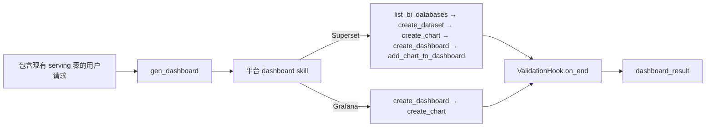

# BI 仪表盘生成指南

## 概览

BI 仪表盘生成 subagent 通过 AI 助手在 Apache Superset 和 Grafana 上创建、更新和管理仪表盘。它由聊天 agent 通过 `task(type="gen_dashboard")` 调用，基于 BI 平台已注册数据库中的现有表或 SQL dataset 创建 BI 资产。

`gen_dashboard` 不用 BI 工具直接搬数据，也不再派发数据准备 subagent。Dashboard 创建应作为第二步执行：

1. 先用 `gen_job` 或 `scheduler` 单独准备 / 刷新 serving 表。
2. 再调用 `gen_dashboard`，传入已经存在的表或 SQL dataset。
3. `gen_dashboard` 加载平台 skill，基于 `bi_database_name` 对应的 BI 数据库创建 dataset / chart / dashboard。

## 什么是 BI 仪表盘 Subagent？

gen_dashboard subagent 是一个专用节点（`GenDashboardAgenticNode`），它：

- 通过 `datus-bi-adapters` 注册表连接到已配置的 BI 平台（Superset 或 Grafana）
- 根据 adapter Mixin 能力动态暴露适合当前平台的工具
- 把已经存在的物化表注册为 dataset / datasource，在其上建图、建面板、组装仪表盘
- agent 结束后自动运行 `bi-validation`

## 快速开始

确保已在 `agent.yml` 中配置 `agent.services.bi_platforms` 并安装了对应的 adapter 包：

```bash
pip install datus-bi-superset   # Superset
# 或
pip install datus-bi-grafana    # Grafana
```

然后直接调用 `gen_dashboard`，或让 chat agent 自动委派给它：

```bash
基于 bi_public.rpt_daily_major_ac_count 在 Superset 上创建一个 dashboard
```

## 工作原理

### 生成工作流



### Superset 工作流

1. `list_bi_databases()` — 根据 `dataset_db.bi_database_name` 匹配得到 `database_id`
2. `create_dataset(name, database_id)` — 把已存在的表注册为 Superset 数据集
3. `create_chart(type, title, dataset_id, metrics, ...)` — 创建可视化图表
4. `create_dashboard(title)` — 创建仪表盘容器
5. `add_chart_to_dashboard(chart_id, dashboard_id)` — 把图表组装进仪表盘
6. 结束本次运行；`bi-validation` 会通过 `ValidationHook.on_end` 自动执行

### Grafana 工作流

1. `create_dashboard(title)` — 创建仪表盘
2. `create_chart(type, title, sql=..., dashboard_id=...)` — 创建内嵌 SQL 的面板，SQL 指向已存在的表；datasource 根据 `dataset_db.bi_database_name` 自动解析
3. 结束本次运行；`bi-validation` 会通过 `ValidationHook.on_end` 自动执行

## 可用工具

工具根据平台 adapter 实现的 Mixin 动态暴露：

| 工具 | 所需能力 | 说明 |
|------|---------|------|
| `list_dashboards` | 所有 adapter | 列出/搜索现有仪表盘 |
| `get_dashboard` | 所有 adapter | 获取仪表盘详情和元数据 |
| `list_charts` | 所有 adapter | 列出仪表盘下的图表 |
| `get_chart` | 所有 adapter | 获取单个图表或面板的详细配置 |
| `get_chart_data` | 支持的 adapter | 获取图表查询结果，用于数值校验 |
| `list_datasets` | 所有 adapter | 列出数据集或数据源 |
| `create_dashboard` | `DashboardWriteMixin` | 创建新仪表盘 |
| `update_dashboard` | `DashboardWriteMixin` | 更新仪表盘标题或描述 |
| `delete_dashboard` | `DashboardWriteMixin` | 删除仪表盘 |
| `create_chart` | `ChartWriteMixin` | 创建图表或 Grafana 面板 |
| `update_chart` | `ChartWriteMixin` | 更新图表配置 |
| `add_chart_to_dashboard` | `ChartWriteMixin` | 将图表添加到仪表盘 |
| `delete_chart` | `ChartWriteMixin` | 删除图表 |
| `create_dataset` | `DatasetWriteMixin` | 在 Superset 中注册数据集 |
| `list_bi_databases` | `DatasetWriteMixin` | 列出 BI 平台数据库连接 |
| `delete_dataset` | `DatasetWriteMixin` | 删除数据集 |
| `get_bi_serving_target` | 已配置 `dataset_db` | 给编排层返回 serving DB 契约 |

`gen_dashboard` 不再暴露直接物化工具。数据搬运应在 dashboard 创建前作为单独的
`gen_job` / `scheduler` 步骤完成。

## 配置

### agent.yml

```yaml
agent:
  services:
    datasources:
      serving_pg:
        type: postgresql
        host: 127.0.0.1
        port: 5433
        database: superset_examples
        schema: bi_public
        username: "${SERVING_WRITE_USER}"
        password: "${SERVING_WRITE_PASSWORD}"

    bi_platforms:
      superset:
        type: superset
        api_base_url: "http://localhost:8088"
        username: "${SUPERSET_USER}"
        password: "${SUPERSET_PASSWORD}"
        dataset_db:
          datasource_ref: serving_pg
          bi_database_name: analytics_pg
      grafana:
        type: grafana
        api_base_url: "http://localhost:3000"
        api_key: "${GRAFANA_API_KEY}"
        dataset_db:
          datasource_ref: serving_pg          # 可以共用同一个 serving DB
          bi_database_name: PostgreSQL

  agentic_nodes:
    gen_dashboard:
      model: claude           # 可选：默认使用已配置的模型
      max_turns: 30           # 可选：默认为 30
      bi_platform: superset   # 可选：当只配置一个 BI 平台时可自动检测
```

### 配置参数

| 参数 | 必需 | 说明 | 默认值 |
|------|------|------|--------|
| `model` | 否 | 使用的 LLM 模型 | 使用已配置的默认模型 |
| `max_turns` | 否 | 最大对话轮数 | 30 |
| `bi_platform` | 否 | `services.bi_platforms` 中的平台键（如 `superset`、`grafana`） | 仅配置一个 BI 平台时自动检测 |
| `services.bi_platforms.<platform>.type` | 否 | BI 平台类型；如果填写，必须与配置键一致 | 使用配置键 |
| `services.bi_platforms.<platform>.api_base_url` | 是 | BI 平台 API 地址 | — |
| `services.bi_platforms.<platform>.username` | Superset | 登录用户名 | — |
| `services.bi_platforms.<platform>.password` | Superset | 登录密码 | — |
| `services.bi_platforms.<platform>.api_key` | Grafana | Grafana API Key | — |
| `services.bi_platforms.<platform>.dataset_db.datasource_ref` | 是 | `services.datasources` 中的条目名；Datus 通过该 datasource 做 schema 探查与写入 | — |
| `services.bi_platforms.<platform>.dataset_db.bi_database_name` | 推荐 | BI 平台中该 DB 的注册别名 | — |

所有敏感值支持 `${ENV_VAR}` 环境变量替换。

`services.bi_platforms` 是 BI 凭据的唯一运行时来源。顶层 `dashboard:` 已不再读取。

## 平台差异对比

| 维度 | Superset | Grafana |
|------|----------|---------|
| Dataset 概念 | 有（物理表/虚拟视图） | 无（SQL 嵌入面板） |
| 创建图表前置条件 | 需要 `dataset_id` | 需要 `dashboard_id` |
| SQL 位置 | Dataset 层 | Panel（图表）层 |
| 数据库连接 | `database_id` 来自 `list_bi_databases()` | Datasource 由 `bi_database_name` 自动解析 |
| `update_chart` 支持 | 支持 | 不支持，需删除后重建 |
| 认证方式 | 用户名 + 密码 | API Key |
| 工作流步骤数 | 6 步 | 3 步 |
| `DatasetWriteMixin` | 已实现 | 未实现 |

## 输出格式

```json
{
  "response": "已创建包含 3 个营收趋势图表的销售仪表盘。",
  "dashboard_result": {
    "dashboard_id": 42,
    "url": "http://localhost:8088/superset/dashboard/42/"
  },
  "tokens_used": 3210
}
```

## 使用示例

### 两步流程

```bash
用 gen_job 把过去 90 天每日营收写入 serving_pg.bi_public.rpt_revenue_daily。
```

表准备好之后：

```bash
/gen_dashboard 基于 bi_public.rpt_revenue_daily 创建一个 Superset dashboard
```

### 直接调用（表已就位于 serving DB）

```bash
/gen_dashboard 基于 bi_public.rpt_sales_daily 在 Superset 建一个销售仪表盘
```

### 更新现有仪表盘

```bash
/gen_dashboard 向仪表盘 42 添加一个月活跃用户图表
```

### 列出现有仪表盘

```bash
/gen_dashboard 列出所有与营收相关的仪表盘
```

### 使用 gen_dashboard 节点类的自定义 subagent

```yaml
agent:
  agentic_nodes:
    sales_dashboard:
      node_class: gen_dashboard
      bi_platform: superset
      max_turns: 30
```

然后通过 `/sales_dashboard 创建季度营收报告仪表盘` 调用。
