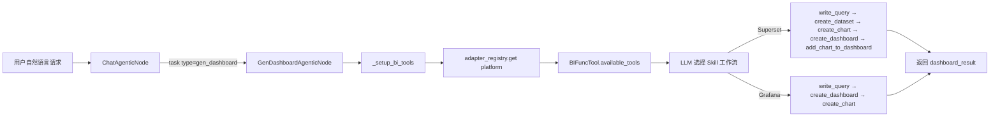

# BI 仪表盘生成指南

## 概览

BI 仪表盘生成 subagent 通过 AI 助手在 Apache Superset 和 Grafana 上创建、更新和管理仪表盘。它由聊天 agent 通过 `task(type="gen_dashboard")` 调用，使用 `BIFuncTool` 层的 LLM function calling 驱动完整的仪表盘创建工作流。

## 什么是 BI 仪表盘 Subagent？

gen_dashboard subagent 是一个专用节点（`GenDashboardAgenticNode`），它：

- 通过 `datus-bi-adapters` 注册表连接到已配置的 BI 平台（Superset 或 Grafana）
- 根据 adapter Mixin 能力动态暴露适合当前平台的工具
- 通过 `write_query` 将源数据库查询结果物化到 BI 平台自有数据库
- 遵循平台特定的 skill 工作流，构建完整可发布的仪表盘

## 快速开始

确保已在 `agent.yml` 中配置 `agent.dashboard` 并安装了对应的 adapter 包：

```bash
pip install datus-agent[bi]   # 安装 datus-bi-superset 和 datus-bi-grafana
```

然后从对话界面调用 subagent：

```bash
/gen_dashboard 创建一个包含按地区营收趋势的销售仪表盘
```

## 工作原理

### 生成工作流



### Superset 工作流（5 步）

1. `write_query(sql, table_name)` — 在源数据库执行 SQL，将结果物化到 Superset 数据库
2. `create_dataset(name, database_id)` — 将物化表注册为 Superset 数据集
3. `create_chart(type, title, dataset_id, metrics, ...)` — 创建可视化图表
4. `create_dashboard(title)` — 创建仪表盘容器
5. `add_chart_to_dashboard(chart_id, dashboard_id)` — 将图表组装进仪表盘

### Grafana 工作流（3 步）

1. `write_query(sql, table_name)` — 在源数据库执行 SQL，将结果物化到 Grafana 数据库
2. `create_dashboard(title)` — 创建仪表盘
3. `create_chart(type, title, sql=..., dashboard_id=...)` — 创建内嵌 SQL 的面板

## 可用工具

工具根据平台 adapter 实现的 Mixin 动态暴露：

| 工具 | 所需能力 | 说明 |
|------|---------|------|
| `list_dashboards` | 所有 adapter | 列出/搜索现有仪表盘 |
| `get_dashboard` | 所有 adapter | 获取仪表盘详情和元数据 |
| `list_charts` | 所有 adapter | 列出仪表盘下的图表 |
| `list_datasets` | 所有 adapter | 列出数据集或数据源 |
| `create_dashboard` | `DashboardWriteMixin` | 创建新仪表盘 |
| `update_dashboard` | `DashboardWriteMixin` | 更新仪表盘标题或描述 |
| `delete_dashboard` | `DashboardWriteMixin` | 删除仪表盘 |
| `create_chart` | `ChartWriteMixin` | 创建图表或 Grafana 面板 |
| `update_chart` | `ChartWriteMixin` | 更新图表配置 |
| `add_chart_to_dashboard` | `ChartWriteMixin` | 将图表添加到仪表盘 |
| `delete_chart` | `ChartWriteMixin` | 删除图表 |
| `create_dataset` | `DatasetWriteMixin` | 在 Superset 中注册数据集 |
| `list_bi_databases` | `DatasetWriteMixin` | 列出 BI 平台数据库连接 |
| `delete_dataset` | `DatasetWriteMixin` | 删除数据集 |
| `write_query` | 已配置 `dataset_db_uri` | 将查询结果物化到 BI 数据库 |

## 配置

### agent.yml

```yaml
agent:
  agentic_nodes:
    gen_dashboard:
      model: claude           # 可选：默认使用已配置的模型
      max_turns: 30           # 可选：默认为 30
      bi_platform: superset   # 可选：省略时从 dashboard 配置自动检测

  dashboard:
    superset:
      api_url: "http://localhost:8088"
      username: "${SUPERSET_USER}"
      password: "${SUPERSET_PASSWORD}"
      dataset_db:
        uri: "${SUPERSET_DB_URI}"
        schema: "public"
    grafana:
      api_url: "http://localhost:3000"
      api_key: "${GRAFANA_API_KEY}"
      dataset_db:
        uri: "${GRAFANA_DB_URI}"
        datasource_name: "PostgreSQL"
```

### 配置参数

| 参数 | 必需 | 说明 | 默认值 |
|------|------|------|--------|
| `model` | 否 | 使用的 LLM 模型 | 使用已配置的默认模型 |
| `max_turns` | 否 | 最大对话轮数 | 30 |
| `bi_platform` | 否 | 显式指定平台名称（`superset` 或 `grafana`） | 从 `dashboard` 配置自动检测 |
| `dashboard.<platform>.api_url` | 是 | BI 平台 API 地址 | — |
| `dashboard.<platform>.username` | Superset | 登录用户名 | — |
| `dashboard.<platform>.password` | Superset | 登录密码 | — |
| `dashboard.<platform>.api_key` | Grafana | Grafana API Key | — |
| `dashboard.<platform>.dataset_db.uri` | 是 | 物化目标数据库的 SQLAlchemy URI | — |
| `dashboard.<platform>.dataset_db.schema` | 否 | 物化表的 schema | — |
| `dashboard.<platform>.dataset_db.datasource_name` | Grafana | Grafana datasource 名称 | — |

所有敏感值支持 `${ENV_VAR}` 环境变量替换。

## 平台差异对比

| 维度 | Superset | Grafana |
|------|----------|---------|
| Dataset 概念 | 有（物理表/虚拟视图） | 无（SQL 嵌入面板） |
| 创建图表前置条件 | 需要 `dataset_id` | 需要 `dashboard_id` |
| SQL 位置 | Dataset 层 | Panel（图表）层 |
| 数据库连接 | `database_id` + dataset | `datasource_name` 自动解析 |
| `update_chart` 支持 | 支持 | 不支持，需删除后重建 |
| 认证方式 | 用户名 + 密码 | API Key |
| 工作流步骤数 | 5 步 | 3 步 |
| `DatasetWriteMixin` | 已实现 | 未实现 |

## 输出格式

```json
{
  "response": "已创建包含 3 个营收趋势图表的销售仪表盘。",
  "dashboard_result": {
    "dashboard_id": 42,
    "url": "http://localhost:8088/superset/dashboard/42/"
  },
  "tokens_used": 3210
}
```

## 使用示例

### 创建新仪表盘

```bash
/gen_dashboard 创建一个包含按地区营收趋势和 GMV 总量大数字卡片的销售仪表盘
```

### 更新现有仪表盘

```bash
/gen_dashboard 向仪表盘 42 添加一个月活跃用户图表
```

### 列出现有仪表盘

```bash
/gen_dashboard 列出所有与营收相关的仪表盘
```

### 使用 gen_dashboard 节点类的自定义 subagent

你可以在 `agent.yml` 中配置使用 `gen_dashboard` 节点类的自定义 subagent：

```yaml
agent:
  agentic_nodes:
    sales_dashboard:
      node_class: gen_dashboard
      bi_platform: superset
      max_turns: 30
```

然后通过 `/sales_dashboard 创建季度营收报告仪表盘` 调用。
