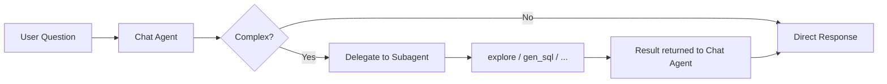

# Subagent Guide

## Overview

Subagents are specialized AI assistants in Datus that focus on specific tasks. Unlike the default chat assistant that handles general SQL queries, subagents are optimized for particular workflows like generating semantic models, creating metrics, or analyzing SQL queries.

## What is a Subagent?

A **subagent** is a task-specific AI assistant with:

- **Specialized System Prompts**: Optimized instructions for specific tasks
- **Custom Tools**: Tailored toolset for the task (e.g., file operations, validation)
- **Scoped Context**: Optional dedicated context (tables, metrics,reference SQL) specific to this subagent
- **Independent Sessions**: Separate conversation history from main chat
- **Task-Focused Workflow**: Guided steps for completing specific objectives

## Available Subagents

### 1. `gen_semantic_model`

**Purpose**: Generate MetricFlow semantic models from database tables.

**Use Case**: Convert a database table structure into a YAML semantic model definition.

**Prerequisites**: This subagent relies on [datus-semantic-metricflow](../adapters/semantic_adapters.md), install it first with `pip install datus-semantic-metricflow`.

**Launch Command**:
```bash
/gen_semantic_model Generate a semantic model for the transactions table
```

**Key Features**:

- Automatically fetches table DDL
- Identifies measures, dimensions, and identifiers
- Validates using MetricFlow
- Syncs to Knowledge Base

**See Also**: [Semantic Model Generation Guide](./gen_semantic_model.md)

---

### 2. `gen_metrics`

**Purpose**: Convert SQL queries into reusable MetricFlow metric definitions.

**Use Case**: Transform ad-hoc SQL calculations into standardized metrics.

**Prerequisites**: This subagent relies on [datus-semantic-metricflow](../adapters/semantic_adapters.md), install it first with `pip install datus-semantic-metricflow`.

**Launch Command**:
```bash
/gen_metrics Generate a metric from this SQL: SELECT SUM(revenue) / COUNT(DISTINCT customer_id) FROM transactions
```

**Key Features**:

- Analyzes SQL business logic
- Determines appropriate metric type (ratio, measure_proxy, etc.)
- Appends to existing semantic model files
- Checks for duplicates

**See Also**: [Metrics Generation Guide](./gen_metrics.md)

---

### 3. `gen_sql_summary`

**Purpose**: Analyze and catalog SQL queries for knowledge reuse.

**Use Case**: Build a searchable library of SQL queries with semantic classification.

**Launch Command**:
```bash
/gen_sql_summary Analyze this SQL: SELECT region, SUM(revenue) FROM sales GROUP BY region
```

**Key Features**:

- Generates unique ID for SQL queries
- Classifies by domain/layer/tags
- Creates detailed summaries for vector search
- Supports Chinese and English

**See Also**: [SQL Summary Guide](./gen_sql_summary.md)

---

### 4. `gen_ext_knowledge`

**Purpose**: Generate and manage business concepts and domain-specific definitions.

**Use Case**: Document business knowledge that isn't stored in database schemas, such as business rules, calculation logic, and domain-specific concepts.

**Launch Command**:
```bash
/gen_ext_knowledge Extract knowledge from this sql
Question: What is the highest eligible free rate for K-12 students?
SQL: SELECT `Free Meal Count (K-12)` / `Enrollment (K-12)` FROM frpm WHERE `County Name` = 'Alameda'
```

**Key Features**:

- **Knowledge Gap Discovery**: Agent attempts to solve the problem first, then compares with reference SQL to identify implicit business knowledge
- Generates structured YAML with unique IDs
- Supports subject path categorization (e.g., `education/schools/data_integration`)
- Checks for duplicates before creating new entries
- Syncs to Knowledge Base for semantic search

**See Also**: [External Knowledge Generation Guide](./builtin_subagents.md#gen_ext_knowledge)

---

### 5. `explore`

**Purpose**: Read-only data exploration subagent for gathering context before SQL generation.

**Use Case**: Quickly collect schema information, data samples, and knowledge base context to support downstream SQL generation tasks.

**Key Features**:

- Strictly read-only — never modifies data or files
- Fast exploration with a 15-turn limit
- Three exploration directions: Schema+Sample, Knowledge, and File
- Optimized for tool-calling with smaller, cost-effective models

**See Also**: [Explore Subagent Details](./builtin_subagents.md#explore)

---

### 6. `gen_sql`

**Purpose**: Generate optimized SQL queries through a specialized SQL expert subagent.

**Use Case**: Delegate complex SQL generation tasks that require multi-step reasoning, complex joins, or domain-specific logic.

**Key Features**:

- Deep SQL expertise with query validation before returning results
- Supports inline SQL and file-based SQL for complex queries (50+ lines)
- Modification support with unified diff format
- Automatic executability validation

**See Also**: [Gen SQL Subagent Details](./builtin_subagents.md#gen_sql)

---

### 7. `gen_report`

**Purpose**: A flexible report generation assistant that combines semantic tools, database tools, and context search capabilities to produce structured reports.

**Use Case**: Generate structured reports with data analysis and insights. Can also be extended by specialized report nodes for domain-specific reporting tasks (e.g., attribution analysis).

**Launch Command**:
```bash
/gen_report Analyze the revenue trend for the last quarter and provide insights
```

**Key Features**:

- Configurable tools: supports `semantic_tools.*`, `db_tools.*`, and `context_search_tools.*`
- Generates structured report content with SQL queries and analysis
- Extensible: can be subclassed for specialized report types
- Configuration-driven: tool setup and system prompts driven by `agent.yml`

**See Also**: [Gen Report Subagent Details](./builtin_subagents.md#gen_report)

---

### 8. Custom Subagents

You can define custom subagents in `agent.yml` for organization-specific workflows.

**Example Configuration**:
```yaml
agentic_nodes:
  my_custom_agent:
    model: claude
    system_prompt: my_custom_prompt
    prompt_version: "1.0"
    tools: db_tools.*, context_search_tools.*
    max_turns: 30
    agent_description: "Custom workflow assistant"
```

## How to Use Subagents

### Method 1: CLI Command (Recommended)

Use the slash command to launch a subagent:

```bash
datus --database production

# Launch subagent with specific task
/gen_metrics Generate a revenue metric
```

**Workflow**:

1. Type `/[subagent_name]` followed by your request
2. Subagent processes the task using specialized tools
3. Review generated output (YAML, SQL, etc.)
4. Confirm whether to sync to Knowledge Base

### Method 2: Web Interface

Access subagents through the web chatbot:

```bash
datus web --database production
```

**Steps**:

1. Click "🔧 Access Specialized Subagents" on the main page
2. Select the subagent you need (e.g., "gen_metrics")
3. Click "🚀 Use [subagent_name]"
4. Chat with the specialized assistant

**Direct URL Access**:
```text
http://localhost:8501/?subagent=gen_metrics
http://localhost:8501/?subagent=gen_semantic_model
http://localhost:8501/?subagent=gen_sql_summary
```

### Method 3: Subagent as Tool (Automatic Delegation)

In addition to manually launching subagents, the default chat assistant can **automatically delegate** complex tasks to specialized subagents via the `task()` tool. This happens transparently — users simply ask questions normally, and the chat agent decides whether to handle them directly or delegate.



**Key Characteristics**:

- **Transparent to users**: No special commands needed — the chat agent routes automatically
- **Intelligent routing**: Chooses the right subagent based on task complexity
- **All subagent types supported**: Any registered subagent can be delegated to

**Available Task Types**:

| Type | Purpose |
|------|---------|
| `explore` | Gather context (schema, data samples, knowledge) before SQL generation |
| `gen_sql` | Generate optimized SQL queries with multi-step reasoning |
| `gen_semantic_model` | Generate MetricFlow semantic model YAML files |
| `gen_metrics` | Convert SQL queries into MetricFlow metric definitions |
| `gen_sql_summary` | Analyze and summarize SQL queries for knowledge reuse |
| `gen_ext_knowledge` | Extract business knowledge from question-SQL pairs |
| `gen_report` | Generate structured reports with data analysis and insights |
| Custom types | Any custom subagent defined in `agent.yml` |

**When does the chat agent delegate?**

| Scenario | Behavior |
|----------|----------|
| Simple questions (SELECT, COUNT, GROUP BY on known tables) | Handles directly |
| Need to discover tables/columns or understand domain terms | Delegates to `explore` |
| Complex SQL with multi-table joins or domain-specific logic | Delegates to `gen_sql` |

**Example Interaction**:

```
User: What's the average revenue per customer by region last quarter?

# Chat agent internally:
# 1. Calls task(type="explore") to discover relevant tables and metrics
# 2. Calls task(type="gen_sql") to generate the complex SQL
# 3. Returns the final SQL with explanation to the user
```

## Subagent vs Default Chat

| Aspect | Default Chat | Subagent |
|--------|-------------|----------|
| **Purpose** | General SQL queries | Specific task workflows |
| **Tools** | DB tools, search tools | Task-specific tools (file ops, validation) |
| **Session** | Single conversation | Independent per subagent |
| **Prompts** | General SQL assistance | Task-optimized instructions |
| **Output** | SQL queries + explanations | Structured artifacts (YAML, files) |
| **Validation** | Optional | Built-in (e.g., MetricFlow validation) |

> **Note**: With Method 3 (Automatic Delegation), the boundary between "default chat" and "subagent" becomes fluid. The chat agent acts as an orchestration layer that transparently uses subagents when needed, so users get the benefits of specialized subagents without manually switching modes.

**When to Use Default Chat**:

- Ad-hoc SQL queries
- Data exploration
- Quick questions about your database

**When to Use Subagent**:

- Generate standardized artifacts (semantic models, metrics)
- Follow specific workflows (classification, validation)
- Build knowledge repositories


## Configuration

### Basic Configuration

Define subagents in `conf/agent.yml`:

```yaml
agentic_nodes:
  gen_metrics:
    model: claude                          # LLM model
    system_prompt: gen_metrics             # Prompt template name
    prompt_version: "1.0"                  # Template version
    tools: generation_tools.*, filesystem_tools.*, semantic_tools.*  # Available tools
    hooks: generation_hooks                # User confirmation
    max_turns: 40                          # Max conversation turns
    workspace_root: /path/to/workspace     # File workspace
    agent_description: "Metric generation assistant"
    rules:                                 # Custom rules
      - Use check_metric_exists to avoid duplicates
      - Validate with validate_semantic tool
```

### Key Parameters

| Parameter | Required | Description | Example |
|-----------|----------|-------------|---------|
| `model` | Yes | LLM model name | `claude`, `deepseek`, `openai` |
| `system_prompt` | Yes | Prompt template identifier | `gen_metrics`, `gen_semantic_model` |
| `prompt_version` | No | Template version | `"1.0"`, `"2.0"` |
| `tools` | Yes | Comma-separated tool patterns | `db_tools.*, semantic_tools.*` |
| `hooks` | No | Enable confirmation workflow | `generation_hooks` |
| `mcp` | No | MCP server names | `filesystem_mcp` |
| `max_turns` | No | Max conversation turns | `30`, `40` |
| `workspace_root` | No | File operation directory | `/path/to/workspace` |
| `agent_description` | No | Assistant description | `"SQL analysis assistant"` |
| `rules` | No | Custom behavior rules | List of strings |

### Tool Patterns

**Wildcard Pattern** (all methods):
```yaml
tools: db_tools.*, generation_tools.*, filesystem_tools.*
```

**Specific Methods**:
```yaml
tools: db_tools.list_tables, db_tools.get_table_ddl, generation_tools.check_metric_exists
```

**Available Tool Types**:

- `db_tools.*`: Database operations (list tables, get DDL, execute queries)
- `generation_tools.*`: Generation helpers (check duplicates, context preparation)
- `filesystem_tools.*`: File operations (read, write, edit files)
- `context_search_tools.*`: Knowledge Base search (find metrics, semantic models)
- `semantic_tools.*`: Semantic layer operations (list metrics, query metrics, validate)
- `date_parsing_tools.*`: Date/time parsing and normalization

### MCP Servers

MCP (Model Context Protocol) servers provide additional tools:

**Built-in MCP Servers**:

- `filesystem_mcp`: File system operations within workspace

**Configuration**:
```yaml
mcp: filesystem_mcp
```

> **Note**: MetricFlow integration is now provided through native `semantic_tools.*` via the [datus-semantic-metricflow](../adapters/semantic_adapters.md) adapter, not through MCP servers.

## Summary

Subagents provide **specialized, workflow-optimized AI assistants** for specific tasks:

- **Task-Focused**: Optimized prompts and tools for specific workflows
- **Independent Sessions**: Separate conversation history per subagent
- **Artifact Generation**: Create standardized files (YAML, documentation)
- **Built-in Validation**: Automatic checks and validation (e.g., MetricFlow)
- **Knowledge Base Integration**: Sync generated artifacts for reuse
- **Flexible Configuration**: Customize tools, prompts, and behavior
- **Automatic Delegation**: Chat agent can transparently delegate to subagents via the `task()` tool
