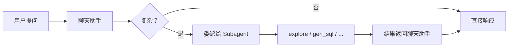

# Subagent 指南

## 概览

Subagent 是 Datus 中专注于特定任务的专用 AI 助手。与处理通用 SQL 查询的默认聊天助手不同，subagent针对特定工作流进行了优化，例如生成语义模型、创建指标或分析 SQL 查询。

## 什么是subagent？

**subagent** 是面向特定任务的 AI 助手，具备以下特性：

- **专用系统提示**：针对特定任务优化的指令
- **自定义工具**：为任务定制的工具集（例如文件操作、验证）
- **范围化上下文**：可选，专用于该subagent的上下文（数据表、指标、Reference SQL）
- **独立会话**：与主聊天分离的对话历史
- **任务导向工作流**：完成特定目标的引导步骤

## 可用subagent

### 1. `gen_semantic_model`

**用途**：从数据库表生成 MetricFlow 语义模型。

**使用场景**：将数据库表结构转换为 YAML 语义模型定义。

**前置条件**：此subagent依赖 [datus-semantic-metricflow](../adapters/semantic_adapters.md)，请先运行 `pip install datus-semantic-metricflow` 安装。

**启动命令**：
```bash
/gen_semantic_model Generate a semantic model for the transactions table
```

**核心特性**：

- 自动获取表 DDL
- 识别度量、维度和标识符
- 使用 MetricFlow 验证
- 同步到知识库

**参考**：[语义模型生成指南](./gen_semantic_model.md)

---

### 2. `gen_metrics`

**用途**：将 SQL 查询转换为可复用的 MetricFlow 指标定义。

**使用场景**：将临时 SQL 计算转换为标准化指标。

**前置条件**：此subagent依赖 [datus-semantic-metricflow](../adapters/semantic_adapters.md)，请先运行 `pip install datus-semantic-metricflow` 安装。

**启动命令**：
```bash
/gen_metrics Generate a metric from this SQL: SELECT SUM(revenue) / COUNT(DISTINCT customer_id) FROM transactions
```

**核心特性**：

- 分析 SQL 业务逻辑
- 确定合适的指标类型（ratio、measure_proxy 等）
- 追加到现有语义模型文件
- 检查重复项

**参考**：[指标生成指南](./gen_metrics.md)

---

### 3. `gen_sql_summary`

**用途**：分析和分类 SQL 查询，用于知识复用。

**使用场景**：构建可搜索的 SQL 查询库，并进行语义分类。

**启动命令**：
```bash
/gen_sql_summary Analyze this SQL: SELECT region, SUM(revenue) FROM sales GROUP BY region
```

**核心特性**：

- 为 SQL 查询生成唯一 ID
- 按域/层级/标签分类
- 创建详细的摘要用于向量搜索
- 支持中文和英文

**参考**：[SQL 摘要指南](./gen_sql_summary.md)

---

### 4. `gen_ext_knowledge`

**用途**：生成和管理业务概念及领域特定定义。

**使用场景**：记录数据库 schema 中未存储的业务知识，例如业务规则、计算逻辑和领域特定概念。

**启动命令**：
```bash
/gen_ext_knowledge Extract knowledge from this sql
Question: What is the highest eligible free rate for K-12 students?
SQL: SELECT `Free Meal Count (K-12)` / `Enrollment (K-12)` FROM frpm WHERE `County Name` = 'Alameda'
```

**核心特性**：

- **知识差距发现**：Agent 首先尝试独立解决问题，然后与参考 SQL 对比，识别隐含的业务知识
- 生成带有唯一 ID 的结构化 YAML
- 支持主题路径分类（例如 `education/schools/data_integration`）
- 创建新条目前检查重复项
- 同步到知识库以供语义搜索

**参考**：[外部知识生成指南](./builtin_subagents.zh.md#gen_ext_knowledge)

---

### 5. `explore`

**用途**：只读数据探索 subagent，用于在 SQL 生成前收集上下文。

**使用场景**：快速收集 schema 信息、数据采样和知识库上下文，为下游 SQL 生成任务提供支持。

**核心特性**：

- 严格只读 — 不会修改数据或文件
- 快速探索，15 轮对话限制
- 三方向探索：Schema+Sample、Knowledge、File
- 针对工具调用优化，可使用较小的高性价比模型

**参考**：[Explore Subagent 详情](./builtin_subagents.zh.md#explore)

---

### 6. `gen_sql`

**用途**：通过专用 SQL 专家 subagent 生成优化的 SQL 查询。

**使用场景**：委派需要多步推理、复杂联表查询或领域特定逻辑的复杂 SQL 生成任务。

**核心特性**：

- 具备深度 SQL 专业知识，返回前自动验证查询可执行性
- 支持内联 SQL 和基于文件的 SQL（适用于 50+ 行的复杂查询）
- 支持修改操作，提供 unified diff 格式
- 自动可执行性验证

**参考**：[Gen SQL Subagent 详情](./builtin_subagents.zh.md#gen_sql)

---

### 7. `gen_report`

**用途**：灵活的报告生成助手，结合语义工具、数据库工具和上下文搜索功能来生成结构化报告。

**使用场景**：生成包含数据分析和洞察的结构化报告，也可以被特定领域的报告节点扩展（如归因分析）。

**启动命令**：
```bash
/gen_report 分析上季度的收入趋势并提供洞察
```

**核心特性**：

- 可配置工具：支持 `semantic_tools.*`、`db_tools.*` 和 `context_search_tools.*`
- 生成包含 SQL 查询和分析的结构化报告
- 可扩展：可被子类化用于特定报告类型
- 配置驱动：工具设置和系统提示由 `agent.yml` 驱动

**参考**：[Gen Report Subagent 详情](./builtin_subagents.zh.md#gen_report)

---

### 8. 自定义subagent

你可以在 `agent.yml` 中定义自定义subagent，用于组织特定的工作流。

**配置示例**：
```yaml
agentic_nodes:
  my_custom_agent:
    model: claude
    system_prompt: my_custom_prompt
    prompt_version: "1.0"
    tools: db_tools.*, context_search_tools.*
    max_turns: 30
    agent_description: "Custom workflow assistant"
```

## 如何使用subagent

### 方法 1：CLI 命令（推荐）

使用斜杠命令启动subagent：

```bash
datus --namespace production

# 使用特定任务启动subagent
/gen_metrics Generate a revenue metric
```

**工作流程**：

1. 输入 `/[subagent_name]` 后跟你的请求
2. subagent使用专用工具处理任务
3. 审阅生成的输出（YAML、SQL 等）
4. 确认是否同步到知识库

### 方法 2：Web 界面

通过网页聊天机器人访问subagent：

```bash
datus web --namespace production
```

**步骤**：

1. 在主页面点击 "🔧 Access Specialized Subagents"
2. 选择需要的subagent（例如 "gen_metrics"）
3. 点击 "🚀 Use [subagent_name]"
4. 与专用助手对话

**直接 URL 访问**：
```text
http://localhost:8501/?subagent=gen_metrics
http://localhost:8501/?subagent=gen_semantic_model
http://localhost:8501/?subagent=gen_sql_summary
```

### 方法 3：Subagent 作为工具（自动委派）

除了手动启动 subagent，默认聊天助手还可以通过 `task()` 工具**自动委派**复杂任务给专用 subagent。这个过程对用户透明 — 用户只需正常提问，聊天助手会自动判断是直接处理还是委派。



**关键特性**：

- **对用户透明**：无需特殊命令 — 聊天助手自动路由
- **智能路由**：根据任务复杂度选择合适的 subagent
- **支持所有 subagent 类型**：任何已注册的 subagent 都可被委派

**可用 task 类型**：

| 类型 | 用途 |
|------|---------|
| `explore` | 在 SQL 生成前收集上下文（schema、数据采样、知识库） |
| `gen_sql` | 生成需要多步推理的优化 SQL 查询 |
| `gen_semantic_model` | 生成 MetricFlow 语义模型 YAML 文件 |
| `gen_metrics` | 将 SQL 查询转换为 MetricFlow 指标定义 |
| `gen_sql_summary` | 分析和总结 SQL 查询用于知识复用 |
| `gen_ext_knowledge` | 从问题-SQL 对中提取业务知识 |
| `gen_report` | 生成包含数据分析和洞察的结构化报告 |
| 自定义类型 | 在 `agent.yml` 中定义的任何自定义 subagent |

**聊天助手何时委派？**

| 场景 | 行为 |
|----------|----------|
| 简单问题（已知表上的 SELECT、COUNT、GROUP BY） | 直接处理 |
| 需要发现表/列或理解领域术语 | 委派给 `explore` |
| 复杂 SQL（多表联接或领域特定逻辑） | 委派给 `gen_sql` |

**交互示例**：

```
用户：上季度各区域每个客户的平均收入是多少？

# 聊天助手内部：
# 1. 调用 task(type="explore") 发现相关表和指标
# 2. 调用 task(type="gen_sql") 生成复杂 SQL
# 3. 将最终 SQL 及解释返回给用户
```

## subagent vs 默认聊天

| 方面 | 默认聊天 | subagent |
|--------|-------------|----------|
| **用途** | 通用 SQL 查询 | 特定任务工作流 |
| **工具** | 数据库工具、搜索工具 | 任务特定工具（文件操作、验证） |
| **会话** | 单一对话 | 每个subagent独立 |
| **提示** | 通用 SQL 辅助 | 任务优化的指令 |
| **输出** | SQL 查询 + 解释 | 结构化工件（YAML、文件） |
| **验证** | 可选 | 内置（例如 MetricFlow 验证） |

> **注意**：通过方法 3（自动委派），"默认聊天"和"subagent"之间的界限变得模糊。聊天助手充当编排层，在需要时透明地使用 subagent，因此用户无需手动切换模式即可享受专用 subagent 的优势。

**何时使用默认聊天**：

- 临时 SQL 查询
- 数据探索
- 关于数据库的快速问题

**何时使用subagent**：

- 生成标准化工件（语义模型、指标）
- 遵循特定工作流（分类、验证）
- 构建知识库

## 配置

### 基础配置

在 `conf/agent.yml` 中定义subagent：

```yaml
agentic_nodes:
  gen_metrics:
    model: claude                          # LLM 模型
    system_prompt: gen_metrics             # SQL模板名称
    prompt_version: "1.0"                  # 模板版本
    tools: generation_tools.*, filesystem_tools.*, semantic_tools.*  # 可用工具
    hooks: generation_hooks                # 用户确认
    max_turns: 40                          # 最大对话轮数
    workspace_root: /path/to/workspace     # 文件工作空间
    agent_description: "Metric generation assistant"
    rules:                                 # 自定义规则
      - Use check_metric_exists to avoid duplicates
      - Validate with validate_semantic tool
```

### 关键参数

| 参数 | 必需 | 描述 | 示例 |
|-----------|----------|-------------|---------|
| `model` | 是 | LLM 模型名称 | `claude`、`deepseek`、`openai` |
| `system_prompt` | 是 | SQL模板标识符 | `gen_metrics`、`gen_semantic_model` |
| `prompt_version` | 否 | 模板版本 | `"1.0"`、`"2.0"` |
| `tools` | 是 | 逗号分隔的工具模式 | `db_tools.*, semantic_tools.*` |
| `hooks` | 否 | 启用确认工作流 | `generation_hooks` |
| `mcp` | 否 | MCP 服务器名称 | `filesystem_mcp` |
| `max_turns` | 否 | 最大对话轮数 | `30`、`40` |
| `workspace_root` | 否 | 文件操作目录 | `/path/to/workspace` |
| `agent_description` | 否 | 助手描述 | `"SQL analysis assistant"` |
| `rules` | 否 | 自定义行为规则 | 字符串列表 |

### 工具模式

**通配符模式**（所有方法）：
```yaml
tools: db_tools.*, generation_tools.*, filesystem_tools.*
```

**特定方法**：
```yaml
tools: db_tools.list_tables, db_tools.get_table_ddl, generation_tools.check_metric_exists
```

**可用工具类型**：

- `db_tools.*`：数据库操作（列出表、获取 DDL、执行查询）
- `generation_tools.*`：生成辅助工具（检查重复、上下文准备）
- `filesystem_tools.*`：文件操作（读取、写入、编辑文件）
- `context_search_tools.*`：知识库搜索（查找指标、语义模型）
- `semantic_tools.*`：语义层操作（列出指标、查询指标、验证）
- `date_parsing_tools.*`：日期/时间解析和规范化

### MCP 服务器

MCP（Model Context Protocol）服务器提供额外工具：

**内置 MCP 服务器**：

- `filesystem_mcp`：工作空间内的文件系统操作

**配置**：
```yaml
mcp: filesystem_mcp
```

> **注意**：MetricFlow 集成现在通过 [datus-semantic-metricflow](../adapters/semantic_adapters.md) 适配器提供的原生 `semantic_tools.*` 工具实现，不再使用 MCP 服务器。

## 总结

subagent提供**专用的、工作流优化的 AI 助手**，用于特定任务：

- **任务导向**：针对特定工作流优化的提示和工具
- **独立会话**：每个subagent拥有独立的对话历史
- **工件生成**：创建标准化文件（YAML、文档）
- **内置验证**：自动检查和验证（例如 MetricFlow）
- **知识库集成**：同步生成的工件以供复用
- **灵活配置**：自定义工具、提示和行为
- **自动委派**：聊天助手可通过 `task()` 工具透明地委派任务给 subagent

