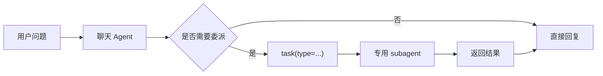

# Subagent 指南

## 概览

Subagent 是 Datus 中的专用 AI 助手。它与主聊天 agent 共用同一份项目配置，但拥有独立的提示词、工具面、会话，以及可选的范围化上下文。

Subagent 可以是：

- 内置系统 subagent，例如 `gen_sql`、`explore`、`scheduler`
- 在 `agent.yml` 的 `agent.agentic_nodes` 下定义的自定义 subagent

## Subagent 包含什么

一个 subagent 可以具备：

- **独立系统提示词**：单独的模板和版本
- **自定义工具**：原生工具、MCP 工具、skills 以及节点级规则
- **范围化上下文**：可选地限制表、指标和 Reference SQL
- **独立会话**：与主 chat 节点分离的对话历史
- **委派策略**：通过 `subagents` 字段控制是否可用 `task()` 委派其他 subagent

## 内置 Subagent

当前代码里由 `SYS_SUB_AGENTS` 定义的内置集合为：

1. `explore`：只读的结构、知识和文件探索
2. `gen_sql`：专用 SQL 生成
3. `gen_report`：结构化报告生成
4. `gen_semantic_model`：MetricFlow 语义模型生成
5. `gen_metrics`：MetricFlow 指标生成
6. `gen_sql_summary`：SQL 摘要生成
7. `gen_ext_knowledge`：业务知识提取
8. `gen_table`：交互式建表
9. `gen_job`：数据管道作业（单库 ETL 和跨库迁移）
10. `gen_skill`：skill 创建与优化
11. `gen_dashboard`：BI 仪表盘创建与管理
12. `scheduler`：Airflow 作业生命周期管理

详细说明见 [内置 subagent](./builtin_subagents.zh.md)。

## 自定义 Subagent

自定义 subagent 配置在 `agent.agentic_nodes` 下。

`/subagent` 向导当前可以创建 `gen_sql` 风格或 `gen_report` 风格的自定义 subagent。如果你想把更专用的节点类别名成一个自定义入口，例如 `explore`、`gen_table`、`gen_skill`、`gen_dashboard`、`scheduler`，需要直接手工编辑 `agent.yml`。

示例：

```yaml
agent:
  agentic_nodes:
    finance_report:
      node_class: gen_report
      model: claude
      system_prompt: finance_report
      prompt_version: "1.0"
      prompt_language: en
      agent_description: "财务分析助手"
      tools: semantic_tools.*, db_tools.*, context_search_tools.list_subject_tree
      subagents: explore, gen_sql
      max_turns: 30
      scoped_context:
        datasource: finance
        tables: mart.finance_daily, mart.finance_budget
        metrics: finance.revenue.daily_revenue
        sqls: finance.revenue.region_rollup
      rules:
        - 优先复用已有财务指标，再决定是否编写新 SQL
```

说明：

- 省略 `node_class` 时默认按 `gen_sql` 处理
- 手工编写 `scoped_context` 时请显式填写 `datasource`
- `subagents` 用于控制该节点可委派的 task 类型

## 如何使用 Subagent

### 方法 1：CLI 斜杠命令

先启动 CLI：

```bash
datus --database production
```

然后使用 `/[name]` 启动 subagent：

```text
/gen_metrics 根据这段 SQL 生成收入指标：SELECT SUM(revenue) FROM orders
/finance_report 分析本季度与上季度的收入变化
```

### 方法 2：Web 界面

启动 Web：

```bash
datus --web --database production
```

直接打开某个 subagent：

```bash
datus --web --database production --subagent finance_report
```

也可以直接访问 URL：

```text
http://localhost:8501/?subagent=gen_metrics
http://localhost:8501/?subagent=finance_report
```

### 方法 3：作为 `task()` 工具被自动委派

主聊天 agent 可以通过 `task()` 把复杂任务委派给专用 subagent。



关键行为：

- `chat` 默认是 `subagents: "*"`，可委派到所有可发现的 subagent
- 多数其他 agentic 节点默认是 `subagents: explore`
- 将 `subagents` 设为空值会禁用 `task()` 工具
- subagent 自身不会再获得嵌套的 `task()` 工具，委派深度上限是两层

### 常见 Task 类型

| 类型 | 用途 |
|------|------|
| `explore` | 收集 schema、样本数据、知识库或文件上下文 |
| `gen_sql` | 执行更深的多步 SQL 推理 |
| `gen_report` | 生成结构化分析报告 |
| `gen_semantic_model` | 生成 MetricFlow 语义模型 |
| `gen_metrics` | 生成 MetricFlow 指标 |
| `gen_sql_summary` | 把 SQL 总结为可复用知识 |
| `gen_ext_knowledge` | 从问题-SQL 对中提取业务知识 |
| `gen_table` | 交互式创建表 |
| `gen_job` | 构建数据管道作业（单库 ETL 或跨库迁移） |
| `gen_skill` | 创建或优化 skill |
| `gen_dashboard` | 创建或管理 BI 仪表盘 |
| `scheduler` | 提交或操作 Airflow 作业 |
| 自定义名称 | `agent.yml` 中可发现的任意自定义 subagent |
