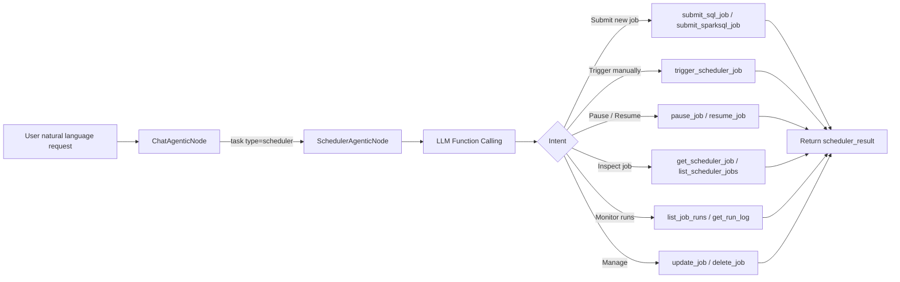

# Scheduler Subagent Guide

## Overview

The scheduler subagent submits, monitors, updates, and troubleshoots scheduled jobs on Apache Airflow. It is invoked by the chat agent via `task(type="scheduler")` and provides full Airflow job lifecycle management through LLM function calling.

## What is the Scheduler Subagent?

The scheduler subagent is a specialized node (`SchedulerAgenticNode`) that:

- Connects to a configured Airflow instance via the `datus-scheduler-airflow` package
- Provides 12 tools covering the complete job lifecycle: submit, trigger, pause, resume, update, delete, and monitor
- Supports both SQL and SparkSQL job types
- Enables log fetching and troubleshooting for failed or running jobs

## Quick Start

Ensure you have configured `agent.scheduler` in `agent.yml` and installed the required packages:

```bash
pip install datus-scheduler-core datus-scheduler-airflow
```

Invoke the subagent from the chat interface:

```bash
/scheduler Submit /opt/sql/daily_revenue.sql as a daily job at 8am using the postgres_prod connection
```

## How It Works

### Workflow Diagram



### Job Submission Flow

When submitting a new job:

1. LLM identifies the SQL file path, connection, and schedule from the user request
2. `list_scheduler_connections` is called to discover available Airflow connections
3. `submit_sql_job` or `submit_sparksql_job` reads the `.sql` file and creates the Airflow DAG with the specified cron schedule
4. The job ID and status are returned in `scheduler_result`

> **Note:** `submit_sql_job` and `submit_sparksql_job` require a `sql_file_path` pointing to an existing `.sql` file on the host. The scheduler node does not include filesystem tools (write_file, etc.), so SQL files must be prepared before invoking the scheduler subagent.

## Available Tools

| Tool | Description |
|------|-------------|
| `submit_sql_job` | Submit a scheduled SQL job from a `.sql` file with cron expression and Airflow connection |
| `submit_sparksql_job` | Submit a scheduled SparkSQL job from a `.sql` file |
| `trigger_scheduler_job` | Manually trigger an immediate run of an existing job |
| `pause_job` | Pause a scheduled job (stops future runs) |
| `resume_job` | Resume a previously paused job |
| `delete_job` | Permanently delete a scheduled job and its DAG |
| `update_job` | Update job schedule, SQL, or other configuration |
| `get_scheduler_job` | Get job details including current status and schedule |
| `list_scheduler_jobs` | List all scheduled jobs, optionally filtered by status |
| `list_scheduler_connections` | List available Airflow connections for job configuration |
| `list_job_runs` | List recent run records for a specific job |
| `get_run_log` | Fetch execution logs for a specific job run |

## Configuration

### agent.yml

```yaml
agent:
  agentic_nodes:
    scheduler:
      model: claude     # Optional: defaults to configured model
      max_turns: 30     # Optional: defaults to 30

  scheduler:
    name: airflow_prod
    type: airflow
    api_base_url: "${AIRFLOW_URL}"       # e.g. http://localhost:8080/api/v1
    username: "${AIRFLOW_USER}"
    password: "${AIRFLOW_PASSWORD}"
    dags_folder: "${AIRFLOW_DAGS_DIR}"   # where generated DAG files are written
    dag_discovery_timeout: 60            # Optional: seconds to wait for DAG discovery
    dag_discovery_poll_interval: 5       # Optional: polling interval in seconds
```

### Configuration Parameters

| Parameter | Required | Description | Default |
|-----------|----------|-------------|---------|
| `model` | No | LLM model to use | Uses default configured model |
| `max_turns` | No | Maximum conversation turns | 30 |
| `scheduler.name` | Yes | Human-readable name for this scheduler | — |
| `scheduler.type` | Yes | Scheduler type (currently `airflow`) | — |
| `scheduler.api_base_url` | Yes | Airflow REST API base URL | — |
| `scheduler.username` | Yes | Airflow login username | — |
| `scheduler.password` | Yes | Airflow login password | — |
| `scheduler.dags_folder` | Yes | Directory for generated DAG files | — |
| `scheduler.dag_discovery_timeout` | No | Seconds to wait for Airflow to discover new DAGs | 60 |
| `scheduler.dag_discovery_poll_interval` | No | Polling interval for DAG discovery | 5 |

All sensitive values support `${ENV_VAR}` substitution.

**Requirements:**
- `datus-scheduler-core` and `datus-scheduler-airflow` packages installed
- Airflow instance accessible from the agent host
- `dags_folder` writable by the agent process and accessible by the Airflow scheduler

## Common Cron Expressions

| Expression | Meaning |
|------------|---------|
| `0 8 * * *` | Every day at 8:00 AM |
| `0 0 * * *` | Every day at midnight |
| `0 8 * * 1` | Every Monday at 8:00 AM |
| `0 8 1 * *` | 1st of every month at 8:00 AM |
| `*/30 * * * *` | Every 30 minutes |
| `0 6,18 * * *` | Twice a day at 6 AM and 6 PM |
| `0 8 * * 1-5` | Weekdays at 8:00 AM |

## Output Format

```json
{
  "response": "Submitted daily SQL job 'daily_revenue' scheduled at 8:00 AM every day.",
  "scheduler_result": {
    "job_id": "daily_revenue_dag",
    "status": "active",
    "schedule": "0 8 * * *"
  },
  "tokens_used": 1580
}
```

For monitoring queries, `scheduler_result` contains run history and log content:

```json
{
  "response": "The last 3 runs of job 'daily_revenue' all succeeded.",
  "scheduler_result": {
    "job_id": "daily_revenue_dag",
    "runs": [
      {"run_id": "scheduled__2024-01-15", "state": "success", "start_date": "2024-01-15T08:00:00"},
      {"run_id": "scheduled__2024-01-14", "state": "success", "start_date": "2024-01-14T08:00:00"},
      {"run_id": "scheduled__2024-01-13", "state": "failed",  "start_date": "2024-01-13T08:00:00"}
    ]
  },
  "tokens_used": 980
}
```

## Usage Examples

### Submit a daily SQL job

```bash
/scheduler Submit a daily SQL job from /opt/sql/daily_revenue.sql at 8am every morning using the postgres_prod connection
```

### Pause a running job

```bash
/scheduler Pause the daily_revenue job
```

### Check job status

```bash
/scheduler Show me the last 5 runs of daily_revenue and their status
```

### Fetch logs for a failed run

```bash
/scheduler Get the logs for the failed run of daily_revenue on 2024-01-13
```

### Update job schedule

```bash
/scheduler Change the schedule of daily_revenue to run at 9am instead of 8am
```

### Custom subagent using scheduler node class

```yaml
agent:
  agentic_nodes:
    etl_scheduler:
      node_class: scheduler
      max_turns: 30
```

Then invoke it via `/etl_scheduler Submit the weekly ETL aggregation job to run every Sunday at midnight`.
