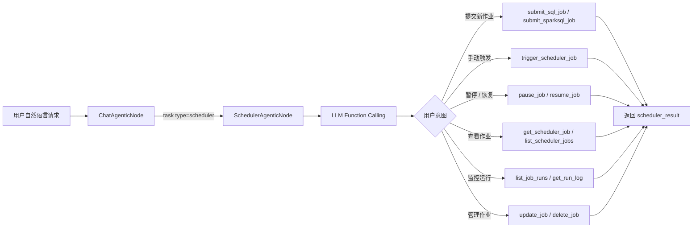

# Scheduler Subagent 指南

## 概览

scheduler subagent 在 Apache Airflow 上提交、监控、更新和排查定时作业。它由聊天 agent 通过 `task(type="scheduler")` 调用，通过 LLM function calling 提供完整的 Airflow 作业生命周期管理。

## 什么是 Scheduler Subagent？

scheduler subagent 是一个专用节点（`SchedulerAgenticNode`），它：

- 通过 `datus-scheduler-airflow` 包连接到已配置的 Airflow 实例
- 提供 12 个工具，覆盖完整的作业生命周期：提交、触发、暂停、恢复、更新、删除和监控
- 支持 SQL 和 SparkSQL 两种作业类型
- 支持获取日志并对失败或运行中的作业进行排查

## 快速开始

确保已在 `agent.yml` 中配置 `agent.scheduler` 并安装了所需包：

```bash
pip install datus-scheduler-core datus-scheduler-airflow
```

从对话界面调用 subagent：

```bash
/scheduler 提交 /opt/sql/daily_revenue.sql 作为每天早上 8 点运行的定时作业，使用 postgres_prod 连接
```

## 工作原理

### 工作流图



### 作业提交流程

提交新作业时：

1. LLM 从用户请求中识别 SQL 文件路径、连接名和调度计划
2. 调用 `list_scheduler_connections` 发现可用的 Airflow 连接
3. `submit_sql_job` 或 `submit_sparksql_job` 读取 `.sql` 文件并使用指定的 cron 调度创建 Airflow DAG
4. 作业 ID 和状态以 `scheduler_result` 形式返回

> **注意：** `submit_sql_job` 和 `submit_sparksql_job` 需要一个 `sql_file_path` 参数，指向主机上已有的 `.sql` 文件。scheduler 节点不包含文件系统工具（write_file 等），因此 SQL 文件必须在调用 scheduler subagent 之前准备好。

## 可用工具

| 工具 | 说明 |
|------|------|
| `submit_sql_job` | 从 `.sql` 文件提交带 cron 表达式和 Airflow 连接的定时 SQL 作业 |
| `submit_sparksql_job` | 从 `.sql` 文件提交定时 SparkSQL 作业 |
| `trigger_scheduler_job` | 手动立即触发一次现有作业运行 |
| `pause_job` | 暂停定时作业（停止后续运行） |
| `resume_job` | 恢复已暂停的作业 |
| `delete_job` | 永久删除定时作业及其 DAG |
| `update_job` | 更新作业调度、SQL 或其他配置 |
| `get_scheduler_job` | 获取作业详情，包括当前状态和调度计划 |
| `list_scheduler_jobs` | 列出所有定时作业，可按状态筛选 |
| `list_scheduler_connections` | 列出可用于作业配置的 Airflow 连接 |
| `list_job_runs` | 列出特定作业的近期运行记录 |
| `get_run_log` | 获取特定作业运行的执行日志 |

## 配置

### agent.yml

```yaml
agent:
  agentic_nodes:
    scheduler:
      model: claude     # 可选：默认使用已配置的模型
      max_turns: 30     # 可选：默认为 30

  scheduler:
    name: airflow_prod
    type: airflow
    api_base_url: "${AIRFLOW_URL}"       # 例如 http://localhost:8080/api/v1
    username: "${AIRFLOW_USER}"
    password: "${AIRFLOW_PASSWORD}"
    dags_folder: "${AIRFLOW_DAGS_DIR}"   # 生成的 DAG 文件写入目录
    dag_discovery_timeout: 60            # 可选：等待 DAG 发现的超时秒数
    dag_discovery_poll_interval: 5       # 可选：轮询间隔秒数
```

### 配置参数

| 参数 | 必需 | 说明 | 默认值 |
|------|------|------|--------|
| `model` | 否 | 使用的 LLM 模型 | 使用已配置的默认模型 |
| `max_turns` | 否 | 最大对话轮数 | 30 |
| `scheduler.name` | 是 | 此调度器的人类可读名称 | — |
| `scheduler.type` | 是 | 调度器类型（目前为 `airflow`） | — |
| `scheduler.api_base_url` | 是 | Airflow REST API 基础 URL | — |
| `scheduler.username` | 是 | Airflow 登录用户名 | — |
| `scheduler.password` | 是 | Airflow 登录密码 | — |
| `scheduler.dags_folder` | 是 | 生成的 DAG 文件目录 | — |
| `scheduler.dag_discovery_timeout` | 否 | 等待 Airflow 发现新 DAG 的超时秒数 | 60 |
| `scheduler.dag_discovery_poll_interval` | 否 | DAG 发现的轮询间隔 | 5 |

所有敏感值支持 `${ENV_VAR}` 环境变量替换。

**前置条件**：
- 已安装 `datus-scheduler-core` 和 `datus-scheduler-airflow` 包
- Agent 主机可访问 Airflow 实例
- `dags_folder` 目录对 agent 进程可写，且 Airflow scheduler 可访问

## 常用 Cron 表达式

| 表达式 | 含义 |
|--------|------|
| `0 8 * * *` | 每天早上 8:00 |
| `0 0 * * *` | 每天午夜 0:00 |
| `0 8 * * 1` | 每周一早上 8:00 |
| `0 8 1 * *` | 每月 1 日早上 8:00 |
| `*/30 * * * *` | 每 30 分钟 |
| `0 6,18 * * *` | 每天早上 6:00 和晚上 18:00 |
| `0 8 * * 1-5` | 工作日早上 8:00 |

## 输出格式

```json
{
  "response": "已提交每日 SQL 作业 'daily_revenue'，每天早上 8:00 运行。",
  "scheduler_result": {
    "job_id": "daily_revenue_dag",
    "status": "active",
    "schedule": "0 8 * * *"
  },
  "tokens_used": 1580
}
```

监控查询时，`scheduler_result` 包含运行历史和日志内容：

```json
{
  "response": "'daily_revenue' 作业最近 3 次运行均成功。",
  "scheduler_result": {
    "job_id": "daily_revenue_dag",
    "runs": [
      {"run_id": "scheduled__2024-01-15", "state": "success", "start_date": "2024-01-15T08:00:00"},
      {"run_id": "scheduled__2024-01-14", "state": "success", "start_date": "2024-01-14T08:00:00"},
      {"run_id": "scheduled__2024-01-13", "state": "failed",  "start_date": "2024-01-13T08:00:00"}
    ]
  },
  "tokens_used": 980
}
```

## 使用示例

### 提交每日 SQL 作业

```bash
/scheduler 提交一个每天早上 8 点运行的日常 SQL 作业，SQL 文件为 /opt/sql/daily_revenue.sql，使用 postgres_prod 连接
```

### 暂停运行中的作业

```bash
/scheduler 暂停 daily_revenue 作业
```

### 查看作业状态

```bash
/scheduler 显示 daily_revenue 最近 5 次运行的状态
```

### 获取失败运行的日志

```bash
/scheduler 获取 daily_revenue 在 2024-01-13 那次失败运行的日志
```

### 更新作业调度

```bash
/scheduler 将 daily_revenue 的调度时间从早上 8 点改为 9 点
```

### 使用 scheduler 节点类的自定义 subagent

```yaml
agent:
  agentic_nodes:
    etl_scheduler:
      node_class: scheduler
      max_turns: 30
```

然后通过 `/etl_scheduler 提交每周日午夜运行的 ETL 汇总作业` 调用。
